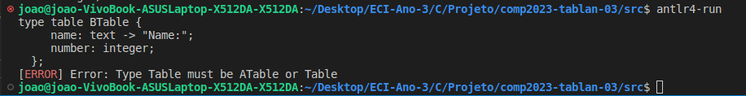
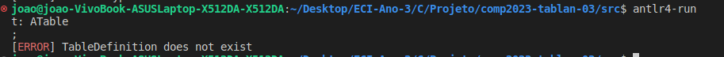
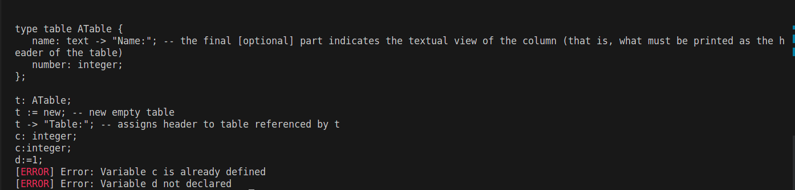
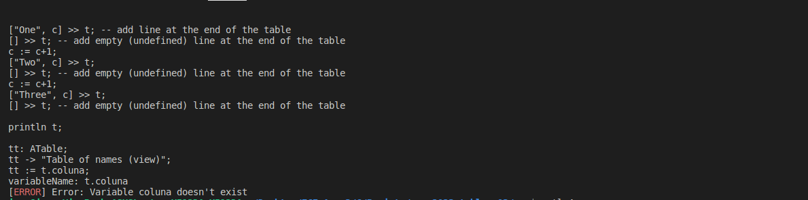
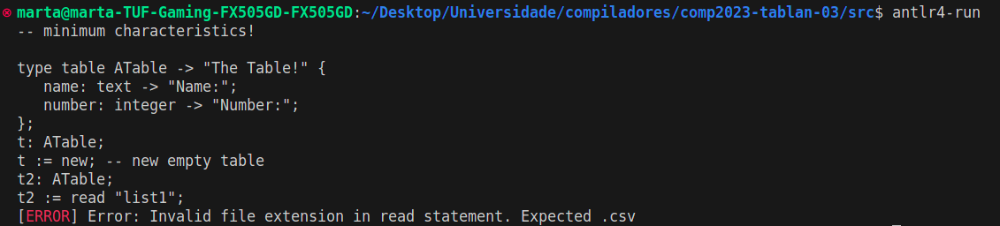

# Tema **TabLan**, grupo **tablan-03**
-----

## Constituição dos grupos e participação individual global

| NMec | Nome | email | Participação |
|:---:|:---|:---|:---:|
|  97640 | FRANCISCO CARDITA NUNES NOVO | franciscocardita@ua.pt | 16.0% |
|  93393 | GUILHERME MARQUES LOPES | guilherme.m.lopes@ua.pt | 5.0% |
|  98506 | JOÃO RICARDO CIDRA FIGUEIREDO | jrcidra@ua.pt | 21.0% |
|  80075 | JOSÉ PEDRO GONÇALVES DOMINGUES | jdomingues@ua.pt | 0.0% |
|  97613 | MARTA ALEXANDRA PINHEIRO OLIVEIRA | marta.alex@ua.pt | 42.0% |
|  97915 | NUNO FILIPE ESTEVES SILVA MATOS | nuno.esteves@ua.pt | 16.0% |

## Estrutura do repositório

- **src** - deve conter todo o código fonte do projeto.

- **doc** -- deve conter toda a documentação adicional a este README.

- **examples** -- deve conter os exemplos ilustrativos das linguagens criadas.

    - Estes exemplos devem conter comentários (no formato aceite pelas linguagens),
      que os tornem auto-explicativos.

## Relatório

Dentro da pasta \examples encontram-se os scripts 'build', 'compile', e 'run'.
Quando se executa o script run, o ficheiro OutputJava.java gerado fica na pasta src e no terminal é apresentado o resultado da execução desse ficheiro.
O nosso projeto contempla os requisitos mínimos, isto é, para os exemplo1.tl, exemplo2.tl e exemplo3.tl.

## Gramática

- ATableGrammar é uma linguagem de consulta e manipulação avançada de tabelas. 
  
  •	O ponto de partida da gramática é o “program”, que permite várias instruções ('statement') seguido do fim de arquivo.

  •	O statement na gramática descreve um tipo de instrução que pode ocorrer no nosso programa, representa diferentes tipos de declarações: uma definição de tabela, uma atribuição, um comando de impressão, adição de uma linha, declaração de um cabeçalho ou um comando de loop.

  •	“tableDefinition” define a sintaxe para definir um novo tipo de tabela. Começa com as palavras-chave 'type' 'table' seguidas por um identificador ID, esta pode opcionalmente ter uma “STRING_LITERAL” para definir um título à tabela. Dentro das chavetas, espera-se uma ou mais “tableColumnDefinition”, isto é, uma série de definições de colunas. Também pode conter definições de fórmulas,“formulaDefinition”, no final. 

  •	Uma “formulaDefinition” permite definir fórmulas para a tabela. Consiste num identificador (ID), seguido de dois pontos e um sinal de igual (:=), e uma expression. 

  •	“tableColumnDefinition” define a sintaxe para as colunas da tabela. Começa com um identificador (ID), seguido de dois pontos (:) e, em seguida, um “dataType”. 
  Pode também conter uma “STRING_LITERAL” para definir um nome específico para esse coluna. 

  •	“dataType“: representa os tipos de dados disponíveis na linguagem: 'integer', 'real' e 'text'.

  •	“assignment”: Esta é uma operação de atribuição, que pode ser aplicada a um campo da tabela ou a um identificador, portanto, pode ter duas formas: 
    quando se acede a um campo de uma coluna (fieldAccess ':=' expression), por exemplo, elem.name := elem.name 
    ou quando se faz outro tipo de operações de atribuição como, por exemplo, criar uma nova instância da tabela à variável t (t := new) ou ser atribuido à tabela os dados de um arquivo csv (ReadStatement)...
  - quando se acede a um campo de uma coluna (fieldAccess ':=' expression), por exemplo, elem.name := elem.name 
    
  - operações de atribuição como, por exemplo, criar uma nova instância da tabela à variável t (t := new) ou ser atribuido à tabela os dados de um arquivo csv (ReadStatement)...

  •	“printStatement” define a sintaxe para declarações de prints. Pode ser 'println' ou 'print'. Essa impressão de valores podem ser uma “expressionList”, que consiste em várias expressions, uma string ou uma “centerExpression”. 

  •	“expressionList” representa uma lista de expressões separadas por vírgula.

  •	“addRowStatement” especifica como adicionar linhas a uma tabela. A adição de tabelas é identificada com o símbolo '>>'. Pode adicionar-se uma linha vazia,'[] >> t', ou uma lista de expressões (["One", c] >> t;) 

  •	A “tableRef” representa uma referência a uma tabela já existente ou a uma nova tabela criada. 

  •	“headerStatement” define a sintaxe para definir cabeçalhos numa tabela ou coluna. Começa com um “tableRef” e pode opcionalmente ter um ponto com ID, quando queremos aceder a uma coluna da tabela. A string define um novo título/header.

  •	Um “loopStatement” representa uma estrutura de loop para executar uma série de comandos. Começa com a palavra-chave 'for' seguida de um identificador (ID), 'in' e uma tableRef. Dentro das chavetas, esperam-se vários “statements”. O loop termina com 'end;'.

  •	“centerExpression” representa uma expressão seguida da palavra-chave 'center' e outra expressão. A segunda expressão pode representar, a largura total da tabela, calculada com base no comprimento dos nomes das colunas da tabela e com mais algum espaço extra para o alinhamento e formatação.

  •	“expression” define a sintaxe para expressões aritméticas. Uma expressão é uma combinação de valores e operadores que é avaliada como um único valor. Consiste numa ou mais expressões “primary” separadas por operadores aritméticos (op=('*' | '/' | '+' | '-' | '+') primary).

  •	“primary” representa as expressões primárias. Em resumo, um primary na nossa gramática é um valor ou expressão que pode ser usada como parte de uma expressão maior. Cada uma das opções listadas é uma maneira diferente que um primary pode tomar. Pode ter várias formas, como “fieldAccess”, “ID”, “INTEGER_LITERAL”, “REAL_LITERAL”, “STRING_LITERAL”,  '(' “expression” ')' etc...
  
  •	“fieldAccess” representa o acesso a um campo numa tabela. Consiste num identificador “ID” que representa a tabela seguido de um ponto com outro identificador ID que representa a coluna, por exemplo, t.name.

  •	“readStatement” define a sintaxe para a leitura de um ficheiro csv para a tabela. Começa com a palavra-chave 'read', seguida de um “STRING_LITERAL”. Pode opcionalmente ter uma “usingClause” no final da expressão.

  •	“usingClause” é usados para mapear colunas do arquivo CSV para campos na tabela.

  •	O “columnMapping” representa o mapeamento de colunas de um arquivo csv para o campo numa tabela. Pode começar com a palavra-chave 'column' (opcional) seguida de um identificador (“ID”), “STRING_LITERAL”, “INTEGER_LITERAL”. Deve ser seguido por 'as' e um identificador (“ID”).


## Compilador
O objetivo do nosso compilador, CompiladorJava, é percorrer a árvore de análise sintática produzida pelo parser e gerar código Java correspondente ao código fonte da linguagem definida na gramática. O nosso compilador está a gerar código Java para os três primeiros exemplos fornecidos.
 
O compilador é construído usando objetos da classe ST. No final, o código vai ser gerado para um ficheiro denominado "OutputJava.java" na pasta src.

O nosso java.stg contem alguns grupos de funções/padrões. Outras funções, que sejam mais simples, criamos uma instância do modelo diretamente no nosso compilador como por exemplo 

``` java
"ST res = new ST("<dataType> <identifier>;");" 
```
 O nosso compilador gera código tendo em conta a classe ATable (e Table que extende ATable) que se encontra dentro da pasta "src/ATable".

 A nossa classe ATable representa a implementação de tabelas, cada tabela é formada por colunas, cada uma com um nome no cabeçalho e um tipo de colunas(Integer, Double, String).A tabela também contém linhas que são mapas dos valores de cada coluna, e se necessário columnFormulas  que são um mapa que armazena funções de cálculo(fórmulas) para determinadas colunas. Essas funções são aplicadas quando uma nova linha é adicionada à tabela.  


``` java
    private List<Map<String, Object>> rows = new ArrayList<>();
    private Map<String, String> columnTitles = new HashMap<>();
    private ColumnType[] columnTypes;
    private String[] headers;
    private String title;
    private Map<String, Function<Map<String, Object>, Object>> columnFormulas = new HashMap<>()
    
     public ATable(String[] headers, ColumnType[] columnTypes,Map<String, Function<Map<String, Object>, Object>> columnFormulas) {
        this.headers = headers;
        this.columnTypes = columnTypes;
        this.columnFormulas = columnFormulas;
    }

    public ATable(String[] headers, ColumnType[] columnTypes) {
        this.headers = headers;
        this.columnTypes = columnTypes;
    }

    public ATable(String[] headers, ColumnType[] columnTypes, String title) {
        this.headers = headers;
        this.columnTypes = columnTypes;
        this.title = title;
    }

    public ATable(String title) {
        this.title = title;
    }
    
    public enum ColumnType {
        Integer,
        Double,
        String;
    }

```

 Esta classe contém vários metodos como:

          1: setTitle(String title)
          2: getRows(): Retorna a linha da tabela
          3: view(String column name):Cria uma nova tabela contendo apenas a coluna especificada.
          4: addRow(Object row)
          5: addRowFromConsole(): Este método lê dados do terminal e adiciona uma nova linha à tabela.
          6: toString()
          7: center(String message, ATable t): Este método centraliza uma mensagem acima da tabela
          8: parse(String filename): Este método lê um arquivo CSV e cria uma nova tabela com os dados do arquivo.

    
## Semântica
Para a nossa verificação semântica usamos um visitor, checkSemantics, do tipo Boolean. Neste visitor fazemos uso da classe ErrorHandling criada pelo professor Miguel Oliveira e Silva e disponível no elearning da cadeira.

Usámos uma tabela de símbolos na análise semântica para armazenar informações sobre os símbolos encontrados no código. 

```java
private SymbolTable symbolTable;
public checkSemantics() {this.symbolTable = new SymbolTable();}
```

A nossa tabela de símbolos é uma estrutura de dados. Esta é utilizada para armazenar nomes e tipos das colunas de uma tabela que é definida, variáveis etc. Neste contexto, durante a verificação semântica garantimos a consistência do código e verificar, por exemplo, se as variáveis são repetidas ou se as mesmas foram declaradas corretamente etc...

A tabela de símbolos é representada pela classe SymbolTable, que possui métodos para adicionar símbolos, consultar símbolos existentes e realizar operações como isVariableDeclared, isFieldAccessValid, isColumnDefined, etc. 

Neste exemplo concreto, verificamos, quando estamos a aceder a um campo de uma tabela, se a tabela existe e se a coluna a aceder também é válida:
```java
@Override
public Boolean visitFieldAccess(ATableGrammarParser.FieldAccessContext ctx) {
    
    String objectName = ctx.ID(0).getText();
    String fieldName = ctx.ID(1).getText();
    
    if (!symbolTable.isVariableDeclared(objectName)) {
        ErrorHandling.printError("Error: Table " + objectName + " not declared in symbol table");
        
    }
    
    if (!symbolTable.isVariableDeclared(fieldName)) {
        ErrorHandling.printError("Error: Field " + fieldName + " not declared in table " + objectName);
        // return false;
    }
    
    return visitChildren(ctx);
}
```

## **Alguns exemplos de verificações**

### 1. **Verificação se o tipo de tabela é do tipo ATable ou Table:**

```
  type table ATable {
	   name: text -> "Name:"; 
	   number: integer;
	};
```
  
  Se, por exemplo, correr algo diferente, como por exemplo:
  ```
  type table BTable {
	   name: text -> "Name:"; 
	   number: integer;
	};
  ```

  Eis o resultado:
  

Assim, deste modo, qualquer declaração de tabelas que não sejam ATable ou Table, são apanhadas pela nossa semântica.

### 2. **Verificação, antes de instanciar uma nova tabela, se o tipo de tabela foi previamente criado:**

Portanto, neste cenário, queremos que a semântica apanhe situações em que se chama uma tabela que não foi estruturada.


Neste exemplo, não declaramos nenhuma tabela e imediatamente a seguir associamos a tabela ATable à variável t, o que não pode acontecer.
```
t: ATable;
```

Para tal, a nossa semântica comporta-se da seguinte forma:



### 3- **Averiguar se existem declarações de variáveis repetidas e se elas foram previamente declaradas**

Portanto, neste cenário queremos que a nossa semântica apanhe situações em que uma variável já tenha sido declarada várias vezes, semelhante a Java:

```java
int c;
int c;
```

Também verificar se as variáveis são previamente declaradas, antes de realizarmos atribuições de valores. Eis um exemplo em java (vamos assumir que não há declarações de variáveis prévias). Neste exemplo, declara-se a variável "c", que diz respeito a um inteiro e imediamente a seguir atribui-se o valor "0" a "d" (variável não declarada)

```java
int c;
d = 0;
```
Eis um exemplo da nossa semântica a verificar estas situações: 


Outro exemplo:


### 4- **Averiguar se as variaveis das colunas que adicionamos via expression, são previamente declaradas**


Eis um funcionamento correto da declaração das variáveis que representam colunas. Dentro da tabela, criamos o n1 e n2, e de seguida vamos dae os valores via terminal a essas colunas, mas para isso temos de verificar a existência das mesmas.

```
type table ATable {
   n1: real;
   n2: real;
   average: real := (n1+n2)/2; -- defined as a formula!
};

t: Table;
t := new; -- new empty table

[real(read in "n1:"), real(read in "n2:")] >> t; -- read in: read text from standard input 
[real(read in "n1:"), real(read in "n2:")] >> t;
```
Eis um exemplo em que se usam colunas que não existem: "read in "x" (x --> não existe)


Outro exemplo:


### 5- **Averiguar se o ficheiro de input é um csv. Caso não seja a nossa semântica levanta um erro**
Neste caso, estamos a passar "list1" em vez de "list1.csv":



### 6- **Verificar se a tabela foi inicialiada ou existe antes de realizar operações**
Neste exemplo, estamos a fazer "t: ATable" sem anteriormente instanciar a tabela, isto é, "t:= new":


Outro exemplo:


Listagem não exaustiva de exemplos.

## Contribuições detalhadas por membro de grupo

| **Team Member**    | **Grammar**  | **CheckSemantics** | **Compilador** | **ATable** | **Relatório** | **Testing** |
|--------------------|:------------:|:------------------:|:---------------------------:|:-----------:|:-------------:|:-------------:|
| Marta Oliveira :cat:    | 30            | 40                | 70                      |   20       |  30            | 20|
| João Figueiredo  :trollface:|     50        |   40                |   10                         |     0        |   35            | 20|
| Francisco Novo   :goat:  |      10        |          0          |              10               |      80       |        15       | 20 |
| Nuno Matos         |        10      |         20           |            5                 |      0       |        20       | 20 |
| Guilherme Lopes    |       0       |          0          |             5                |       0      |       0        | 20 |
| José Domigues |        0      |        0           |         0               |    0         |      0        | 0 |


