# Segurança

## 1 - Introduction

**Objective - **Defense against non-authorized activities

- Computers can do a lot of damage in a short time frame
- The number of weakness is always growing
- Networks allow anonymous attacks from anywhere
- In general users are not careful

#### Pragmatic Approach

- There will never be a 100% protection
- Security is expensive. Dedicated technology, skilled people
- **Protection - **Good protection for the most frequent attacks
- **Value - **Less interference with daily work that the damage caused by attackers
- **Punishment - **Police and courts for tracking and prosecuting attackers

#### Security Lexicon

**Vulnerability - **A system weakness that makes it sensible to attacks

**Attack - **A set of steps that lead to the execution of illegal activities

**Risk / Threats - **Damage resulting from an attack

**Defense - **Set of policies and mechanisms aiming at improve the problems above

#### Security Risks

- Information, time and money
- Confidentiality
- Privacy
- Resource availability
- Impersonation

#### Vulnerability Sources

- People
- Applications with bugs
- Malware installation

#### Security Policies

- Define the power of each and every subject
- Define security procedures
- Define the minimum security requirements of a domain
- Define defense strategies and fight-back tactics
- Define the universe of legal and illegal activities

#### Attacks to Distributed Systems

- **Attacks to hosts - **Stealing. Intrusion. Impersonation. Denial of service
- **Attacks to networks - **Packet inspection. Packet tampering. Traffic interception. Traffic replaying. Host impersonation. Denial of service

#### Attack Models

- **Target-specific attacks - **Conceived for a particular host / network. Idealized and conducted in real-time by specialists
- **Generic, autonomous attacks - **Conceived for exploiting well-known, common vulnerabilities. Coded for many scenarios and targets. Mean survivability time

#### Mechanisms for Distributed Systems

- **Trusted Operating Systems - **Security levels, certification. Sandboxing / virtual machines
- **Firewalls & Security Appliances - **Traffic control between networks. Monitoring
- **Secure Communications / VPNs - **Secure channels over insecure, public networks
- **Authentication - **Local. Remote. Single Sign-On
- **Certification Authorities / PKI - **Management of public key certificates
- **Encryption of files and sessions - **Privacy / confidentiality of network data and long-term stored data
- **Intrusion Detection - **Detection of forbidden / abnormal acivities
- **Vulnerability Scanners - **Scanning for problem fixing or exploitation
- **Penetration Testing - **Vulnerability assessment. Demo penetration attempts. Testing of installed security mechanisms. Assessment of badly implemented security policies.
- **Content Monitoring - **Detection of virus, worms or other cyber plagues
- **Security Administration - **Development of security policies. Distributed enforcement of policies
- **Real-Time Security Awareness - **Capacity to detect and react to security indicents in real-time

## 2 - Vulnerabilities

### Measures

- **Discouragement** - Punishment. Security Barriers
- **Detection System** - Intrusion detection system. Auditing. Forensic break-in analysis.
- **Deception** - Honeypots / Honeynets. Forensic follow-up
- **Prevention** - Enforcement of the principle of Least Privilege. Vulnerability Scanning
- **Recuperation** - Backups. Redundant systems

**Measure enforcement** requires knowledge about

- Known vulnerabilities
- Activity patterns used in attacks
- Abnormal activity patterns

**Computer network threats** are not like other threats

- Can be launched anytime, anywhere. Easily coordinated. Cheap to deploy. Automated and fast.
- Require 24x7 capacity to react to attacks

#### Zero-day (or zero-hour) attack or threat

Attack using vulnerabilities which are

- Unknown to others
- Undisclosed to the software vendor

Occurs at the day zero of the knowledge about those vulnerabilities

### Vulnerability Detection

Specific tools can detect vulnerabilities

- Exploiting known vulnerabilities
- Testing known vulnerability patterns

Vital to assert the robustness of production systems and applications

Can be applied to

- Source code
- Running application (dynamic, analysis)
- Externally as a remote client

### CVE (Common Vulnerabilities and Exposures)

**Dictionary** of publicly known information security vulnerabilities and exposures

CVE's common identifiers enable data exchange between security products and provide a baseline index point for evaluating coverage of tools and services

#### CVE Vulnerability

- A mistake in software, that can be directly used by a hacker
- A mistake is a vulnerability if it allows an attacker to use it violate a security policy for that system
- A **CVE vulnerabilty** is a state in a computing system that allow an attacker to
  - Execute commands as another user
  - Access data that is contrary to the specified access restrictions
  - Pose as another entity
  - Conduct a denial of service

#### CVE Exposure

- A system configuration issue or a mistake in software that allows access to information
- A configuration issue or mistake is an exposure if it does not directly allow compromise
- A **CVE exposure** describes a state in a computing system that is not a vulnerability but
  - Allows an attacker to conduct information gathering activities or hide activities
  - Includes a capability that behaves as expected, but can be compromised
  - Is a primary point of entry that an attacker may attempt to use to gain access to the system
  - Is considered a problem by some reasonable security policy

#### CVE Benefits

- Provides common language for referring to problems
- Will lead to improved security tools
- Will spark further inovations

**CVE Pitfals - **Useless against zero-day attacks

#### CVE Identifiers

- Unique, common identifiers for publicly known information security vulnerabilities
  - Have "candidate" or "entry"status
  - **Candidate - **under review for inclusion in the list
  - **Entry - **accepted to the CVE list

### CWE (Common Weakness Enumeration)

Common language of discourse for discussing, finding and dealing with the causes of software security vulnerabilities

- Found in code, design, or system architecture
- Each individual CWE represents a single vulnerability type

**Seven Pernicious Kingdoms - **Input validation. API abuse. Security features. Time and state. Errors. Code quality. Encapsulation. Environment

**CERT (Computer Emergency Readiness Team) - **Organization devoted to ensuring that appropriate technology and systems management practices are used to resist attacks no networked systems

**CSIRT (Computer Security Incident Response Team) - **Service organization that is responsible for receiving, reviewing, and responding to computer security incident reports and activity

## 3 - XSS Cross-Site Scripting

Injection of scripts provided by clients into Web pages

Inherent to how HTML works

**Correct Usage - **\ \</img>

**Not Correct Usage - **\

​									 \

​								     \</img>

#### **Information Stealing**

\\</img>

Open window, sends current cookie to bad.com

#### Injection Vectors

- **Any non parsed text -** \
Hi there\\

- **Media tags - **\\</img>
- **URLs - **http://foo.bar/index.php?search=\

#### Stored XSS                                                        |                                                 Reflected XSS

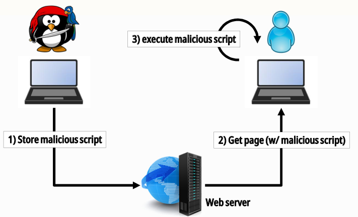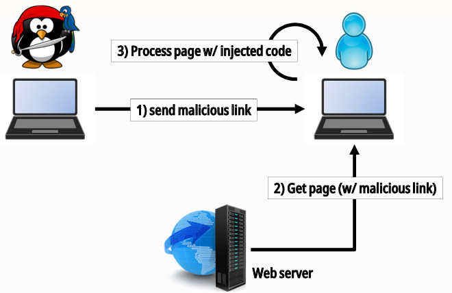

#### Cross-Site Request Forgery

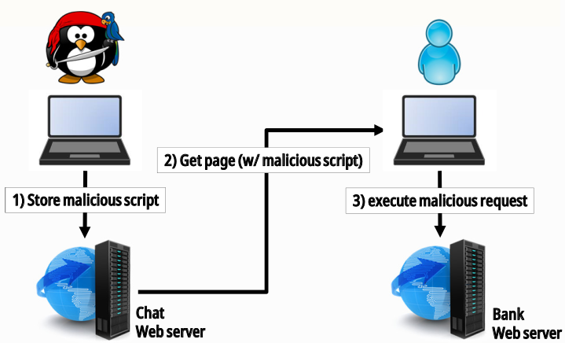

## 4 - Buffer Overflows

#### Memory Organization Topics

- Kernel organizes memory in **pages**
- Processes operate in a **virtual memory space**
- Kernel groups pages in several segments

#### x86 CPU Registers

- **General Purpose -** EAX, EBX, ECX, EDX
- **EBP: Base Pointer - **Base address of the current function stack frame. Function stack frame is where we have: The function parameters. The local function variables.
- **ESP: Stack Pointer - **Points to end of stack
- **EIP: Instruction Pointer - **Points to current instruction

#### Stack Segment

- Stack is used to
  - Pass arguments to functions (eg. **arg1**)
  - Store local variables (eg. **var1**)
- Values are PUSHed or POPed form Stack
- Allocation of local variables in place

#### Initialization of a Stack Frame

- This is done in the **prologue** of a function. And it's undone at its **epilogue**

**Prologue**

- Saving the base address of the previous stack frame and setting the new one
- Allocate space for local variables

#### Function Call and Return

**Call Steps**

- Put arguments in stack, with PUSH
- Call the function address. Pushes the EIP to the stack. EIP has the next instruction address
- Release stack space. Usually increasing ESP

**Returning form a function**

- The RET instruction pops the saved EIP

#### Function foo()

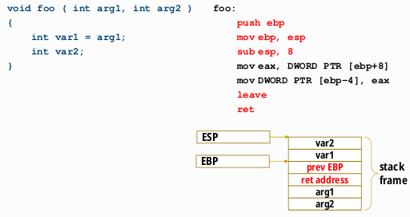

#### Buffer Overflow

- Write over the boundaries of a buffer
- Consequences
  - Write over other values located next to the buffer
  - Write over special values co-located
    - Saved EBP - Damages the base address of the previous stack frame
    - Return EIP - Jump to any address on return

#### Stack Smashing Attack

- **Roadmap**
  - Overflow a local variable
  - Extend the overflow to the return address
  - Change the return address in order to jump to the injected data
  - Wait for the return of the function
- **Dificulty**
  - A return using a saved address is an absolute jump
  - The attacker needs to know the absolute address of the vulnerable variable

#### Prevention Mechanisms

- Avoid execution of injected instructions in segments/pages that usually have no code
- Randomize the address space. ADLR (Addresss Space Layout Randomization)
  - Segments do not start in fixed positions of each run of the same application
  - Prevents jumps to well-known code locations
- Variable reordering
  - Vulnerable variables are arrays. To protect other kinds of local variables, arrays are moved closer to the saved registers. Reduces the set of variables that may be affected by a buffer overrun

#### Detection Mechanisms

- **Stack canaries** -» A value unknown to attackers (canary) is stored next to saved registers
  - Stack smashing attacks usually cannot affect saved registers with running over a canary
  - The canary is checked before the function's epilogue

## 5  -SQL Injection

> Not now

## 6 - ARP Poisoning

### Networking Basics

- Communication in packet networks rely on several layers, with different identifiers
  - Applications use transport (TCP / UDP) ports
  - Hosts use network (IP) addresses
  - Interface Cards use MAC addresses
- Communication is made between applications using tuples
- When a packet is to be routed, two situations may occur
  - The destination host is in the same/another network
  - In both cases, the packet is transmitted between physical interfaces
- IP addresses do not change between source and destination (End-to-end addressing)
- MAC addresses are valid for a single network segment

#### IP to MAC Mapping

- **Static Configuration**
  - MAC entries of all hosts configured statically
    - All hosts "know" the MAC address of all interfaces of all other hosts
  - Doesn't scale
- **Dynamic Configuration**
  - ARP (Address Resolution Protocol)

#### ARP

- Find the MAC address of an interface which is in a host with a given IP address
- **RARP - **Find the IP address of host having an interface with a given MAC
- Every packet sent requires two MAC address
  - Source address is known
  - Destination address must be determined
- ARP cache increases performance
  - Caches both known and unknown entries
  - Avoids repeating the discovery process per packet
  - Entries have a large lifetime - 2 minutes

#### ARP Spoofing

- MAC addresses can be modified
- Using a colliding MAC address will allow the reception of network traffic for other hosts
  - Some switches limit MAC addresses to single ports
- Sending ARP packets with spoofed addresses may poison the cache of other stations

### ARP Poisoning

- Hosts cache information directly from all packets received
  - Besides ARP packets
  - No other verification is done
- New information will replace existing entries
- It is possible to send specially crafted packets to create specific entries in remote hosts

##### Consequences

- Hosts can be isolated from the network
- Hosts can be denied communication with the outside world
- Interception of traffic between hosts

##### Avoidance

- **Static entries**
  - No resolution process is triggered
  - Colliding information from ARP packets is discarded
- **Port-based packet filtering at switch ingress**
  - Spoofed ARP packets are dropped
  - Only possible in static scenarios
- **Network segregation**
  - VLANs, WiFi client segregation
- **Behavior detection w/ monitoring software**
  - Detect ARP Responses without Request
  - Detect repeated requests from same host
  - Detect MAC changes

## 7 - Cryptography

**Cryptography - **Art of science of hidden writing. Used to maintain the confidentiality of information

**Cryptanalysis - **Art or science of breaking cryptographic systems or encrypted information

**Cryptology - **Cryptography + cryptanalysis

**Cipher - **Specific cryptographic technique

#### **Cipher operation**

- **Encryption** - plaintext -» ciphertext
- **Decryption** - ciphertext -» plaintext
- **Algorithm** - way of transforming data
- **Key** - algorithm parameter

#### Use Cases

- Self-protection
- Secure communication

#### Cryptanalysis Goals

- Discover original plaintext. Which originated a given ciphertext
- Discover a cipher key. Allows the decryption of ciphertexts created with the same key
- Discover the cipher algorithm. Or an equivalent algorithm

#### Cryptanalysis Attack Approaches

- **Brute Force**
  - Exhaustive search along the key space until finding a suitable key. Usually infeasible for a large key space
- **Cleaver Attacks**
  - Reduce the search space to a smaller set of potential candidates

### Ciphers Basic Types

- **Transposition - **Original cleartext is scrambled
- **Substitution - **Each original symbol is replaced by another
  - **Mono-alphabetic - **Use a single substitution alphabet
    - Problems
      - Reproduce plaintext pattern
      - Statistical analysis facilitates cryptanalysis
  - **Polyalphabetic - **Use N substitution alphabets. Periodical ciphers, with period N
    - Problems
      - Once known the period, are as easy to cryptanalyze as N mono-alphabetic ones
      - The period can be discovered using statistics

#### Rotor Machines

Implement complex polyalphabetic ciphers

- Each rotor contains a permutation. Same as a set of substitutions.
- The position of a rotor implements a substitution alphabet
- Spinning of a rotor implements a polyalphabetic cipher
- Stacking several rotors and spinning them at different times adds complexity to the cipher

The **cipher key** is

- The set of rotors used
- The relative order of the rotors
- The position of the spinning ring
- The original position of all the rotors

Symmetrical (two-way) rotors allow decryption by "double encryption"

### Cryptography Theoretical Analysis

- **Plaintext Space - **Set of al possible plaintext messages (**M**)
- **Ciphertext Space - **Set of all possibel ciphertext values (**C**)
- **Key Space - **Set of all possible key values for a given algorithm (**K**)

#### Practical Approaches

- **Theoretical security vs Practical Security**
  - Expected use =/ practical exploitation
  - Defective practices can introduce vulnerabilities
- **Computational security**
  - Security is measured by the computational complexity of break-in attacks using brute force
- **5 Shannon Criteria**
  - The amount of offered secrecy (Key Length)
  - Complexity of key selection (Key Generation)
  - Implementation simplicity
  - Error propagation
  - Dimension of ciphertexts
- **Confusion**
  - Complex relationship between the key, plaintext and the ciphertext. Output bits should depend on the input bits in a very complex way
- **Diffusion**
  - Plaintext statistics are dissipated in the ciphertext. If one plaintext bit toggles, the the ciphertext changes substantially, in an unpredictable or pseudorandom manner
- **Always assume the worst case**
  - Cryptanalysis knows the algorithm. Security lies in the key
  - Cryptanalysts know/have many ciphertext samples produced with the same algorithm & key
  - Cryptanalysts partially know original plaintexts 

#### Cryptographic Robustness

- The robustness of algorithms is their resistance to attacks. Not precisely evaluated. They are robust until someone breaks them. Public guidelines with what should/must not be used
- Public algorithms without known attacks are likely to be more robust
- Algorithms with longer keys are likely to be more robust (and slower)

### Stream Ciphers

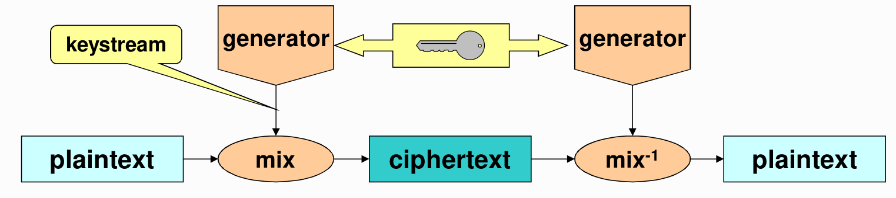

- Mixture of a keystream with the plaintext or ciphertext
  - **Random** keystream
  - **Pseudo-random** keystream
- Reversible mixture function

- **Polyalphabetic** cipher. Each keystream symbol defines an alphabet
- Keystream may be infinite but with a finite period. The period depends on the generator
- Pratical security issues
  - Each **keystream** should be used only **once**!
  - **Plaintext length** should be **smaller** than the **keyword period**
  - Integrity control is mandatory. No diffusion! (only confusion)

### Modern Ciphers

**Concerning operation**

- Block ciphers (mono-alphabetic)
- Stream ciphers (polyalphabetic)

**Concerning their key**

- Symmetric ciphers (secret key or shared key ciphers)
- Asymmetric ciphers (or public key ciphers)

**Arrangements**

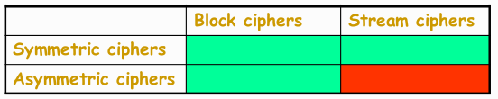

### Symmetric Ciphers

- **Secret Key - **Shared by 2 ou more peers
- **Allow - **Confidentiality among the key holders. Limited authentication of messages
- **Advantages - **Performance
- **Disadvantages - **N interacting peers, pairwise secrecy -» N x (N-1) / 2 keys
- **Problems - **Key distribution

#### Symmetric Block Ciphers

- Large bit blocks. 64, 128, 256, etc.
- Diffusion & confusion
- **Common algorithms**
  - DES (Data Enc. Stand) D=64 K=56
  - IDEA (Int. Data Enc. Alg.) D=64 K=128
  - AES (Adv. Enc. Stand) D=128 K= 128, 192, 256

##### DES (Data Encryption Standard)

- 64-bit blocks
- 56-bit keys
- Diffusion & confusion
  - Feisel networks
  - Permutations, substitutions, expansions, compressions
  - 16 iterations
- Several modes of operation
  - **ECB** (Electronic Code Book), **CBC** (Cypher Block Chaining), **OFB** (Output Feedback), **CFB** (Cypher Feedback)

---

- Key selection -» Most 56-bit values are suitable keys
- Known attacks -» Exhaustive key space search
- Key length -» 56 bits are too few. Exhaustive search is technically possible and economically interesting.
  - Solution: Multiple encryption

#### Symmetric Stream Ciphers

- Cryptographically secure pseudo-random generators (PRNG)
  - Using linear feedback shift registers (**LFSR**)
  - Using block ciphers
- Usually not self-synchronized
- Usually without uniform random access
- **Common algorithms**
  - A5/1, A5/2 | RC4 | E0 | SEAL

##### Linear Feedback Shift Register (LFSR)

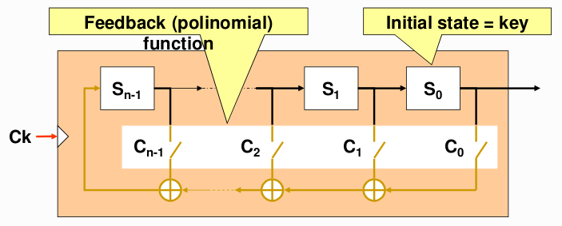

#### Block Ciphers Modes

##### ECB and CBC

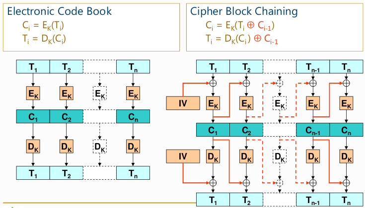

- Block cipher modes ECB and CBC require block-aligned inputs. Trailing sub-blocks need special treatment
  - Alternatives -» Padding or different processing for the last block

#### Stream Cipher Modes 

##### OFB (Output Feedback)                                                  |                                             CFB (Ciphertext Feedback)

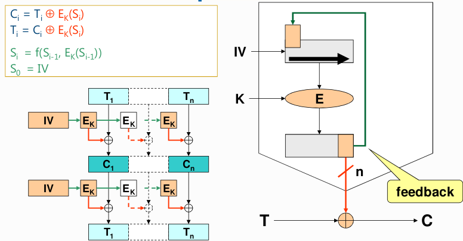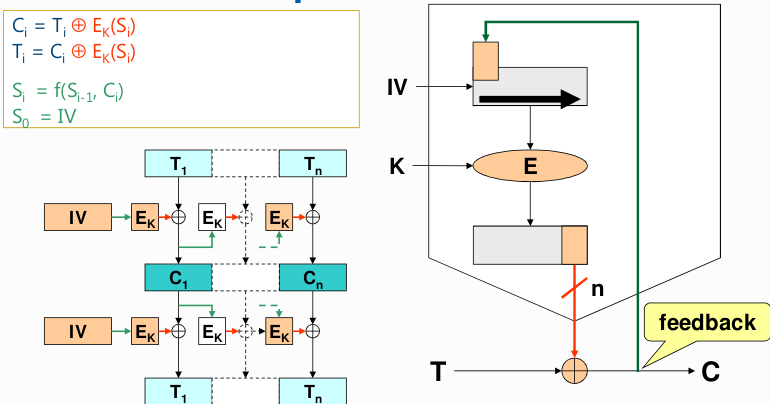

##### Pros and Cons

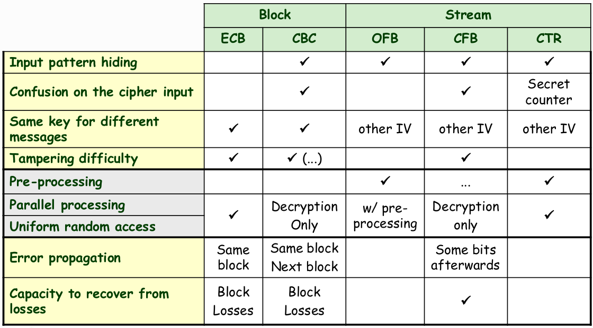

##### Security Reinforcement

- Double Encryption. Breakable with a meet-in-the-middle attack in 2^(n+1) attempts. Not secure enough
- Triple Encryption (EDE)

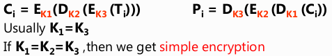

- Whitening (DESX). Simple and efficient technique to add confusion

### Asymmetric Ciphers

- **Use Key Pairs - **One private key (personal). One public key
- **Allow - **Confidentiality without any previous exchange of secrets
- **Disadvantages - **Performance (very inefficient and memory consuming)
- **Advantages - **N peers requiring pairwise, secret interaction -» N key pairs
- **Problems - **Distribution of public keys. Lifetime of key pairs

#### Confidentiality

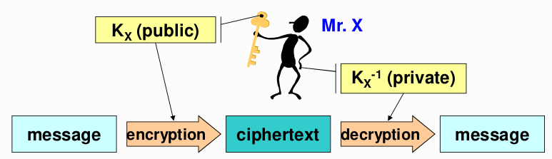

- Only the key pair of the recipient is involved. To send something with confidentiality to X is only required to know X's public key(Kx)
- There is no source authentication. X has no means to know who produced the ciphertext.

#### Source Authentication

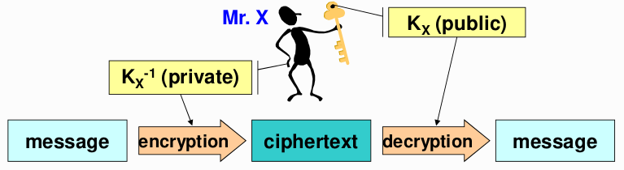

- Only the key pair of the originator is involved. Only X knows that Kx⁻¹ produced C
- There is no confidentiality. Anyone knowing the public key of the originator (Kx) can decrypt C

#### Asymmetric Block Ciphers

- Discrete logarithms of large numbers
- Integer factorization of large numbers
- Knapsack problems
- **Common Algorithms**
  - RSA | ElGamal | Elliptic curves

##### RSA (Rivest, Shamir, Adelman)

- Discrete logaritm
- Integer factoring
- **Key Selection**
  - Large **n**;   **n** = **p**x**q**;   **p** and **q** being large (secret) prime numbers
  - Chose an **e** co-prime with (**p**-1)x(**q**-1)
  - Compute **d** such that **e**x**d** = 1 mod (**p**-1)x(**q**-1)
  - Discard **p** and **q**
- **Example**

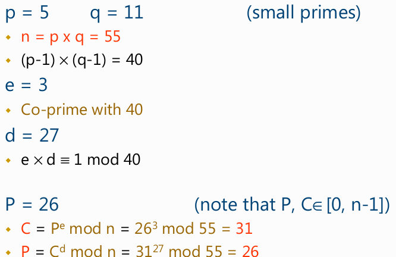

##### ElGamal

- Similar to RSA but using only discrete logarithm complexity
- Used for digital signatures

##### Elliptic Curve

- Curves of a kind that are symmetric to the X axis. And don't have solution for all x values
- Given an elliptic curve **E(Fp)**, a point **G** on that curve, a point **P** which in an integer multiple of **G**, find the integer **x** such that **xG = P**
- For cryptographic operatoins **x** wiil be the **private key** and **P** the **public key**
- **Curves Definition**
  - Prime **p** -» **(p, a, b, G, n, h)**
    - Constants **a** and **b** of the EC equation
    - A generator point **G**
    - The order **n** of **G**
    - A small co-facto **h**
- **EC Diffie-Hellman (ECDH)**
  - Alice and Bob agree of EC curve
  - Alice chooses a **random alpha**. And publishes **A = alpha.G**
  - Bob chooses a **random beta**. And publishes **B = beta.G**
  - Both Alice and Bob compute **K**

#### Randomization of Asymmetric Encryptions

- **N** encryptions of the same value, with the same key, should yield **N** different results
- Goal -» prevent the trial & error discovery of encrypted values
- Technics -» Concatenation of value to encrypt with two values. A fixed one and a random one

### Digest Functions

- Give a fixed-length value from a variable-length text
- Produce very different values from similar texts. Cryptographic one-way hash functions
- **Properties**
  - **Preimage resistance - **Given a digest, it is infeasible to find an original text producing it
  - **2º preimage resistance - **Given a text, it is infeasible to find another one with the same digest
  - **Collision resistance - **It is infeasible to find any two texts with the same digest
- **Most common algorithms**
  - **MD5 - **No longer secure. Easy to find collisions
  - **SHA-1 - **No longer secure... (collisions found in 2017)
  - **SHA-2 (SHA-256/SHA-512), SHA-3**

### Message Authentication Codes (MAC)

- Hash, or digest, computed with a key. Only key holders can generate / validate the MAC
- Encryption of an ordinary digest (for instance, a symmetric block cipher)

#### Authenticated Encryption

- Encryption mixed with integrity control. Error propagation. Authentication tags
- **Encrypt-then-MAC - **MAC is computed from cryptogram
- **Encrypt-and-MAC - **MAC is computed from plaintext. MAC is not encrypted
- **MAC-then-Encrypt - **MAC is computed from plaintext. MAC is encrypted

### Digital Signatures

- Authenticate the contents of a document -» Integrity
- Authenticate its author -» Identity
- Prevent origin repudiation -» Authorship
- **Approaches**
  - Asymmetric encryption
  - Digest functions

**Blind Signatures - **Signatures made by a "blinded" signer. Signer cannot observe the signed contents

## 8 - Assimetric Key Management

#### Problems to Solve

- Ensure a proper generation of key pairs
  - Random generation of secret values
  - Increase efficiency without reducing security
- Ensure a correct use of asymmetric key pairs
  - Privacy of private keys
  - Correct distribution of public keys
- Evolution of **entity «-» key pair** bindings. We cannot have eternal key pairs
  - Tackle catastrophic occurrences (Loss of private keys)
  - Tackle normal exploitation requirements (Reducing impersonation risks)
  - Tackle the evolution of technology and know-how

#### Goals

- Key pair generation. When and how
- Exploitation of private keys. Keeping them private
- Distribution of public keys
- Lifetime of key pairs

#### Design Principles

- Good random generators for producing secrets
- Facilitate without compromising security. Efficient RSA public keys
- Self-generation of private keys. To maximize privacy

#### Exploitation of Private Keys

**Correctness**

- The private key represents a subject. Compromise must be minimized
- Access path to the private key must be controlled. Access protection with password and PIN

**Confinement**

- Protection of the private key inside a (reduced) security domain (cryptographic token)
  - Token generates key pairs
  - Token exports the public key but never the private key
  - Token internally encrypts/decrypts with the private key

#### Distribution of Public Keys

- Distribution to all **senders** of confidential data
- Distribution to all **receivers** of digital signatures
- Trustworthy dissemination of public keys
  - I entity A trusts entity B and B trusts in C then A trusts in C

#### Public Key Digital Certificates

- Documents issued by a Certification Authority (CA)
  - Bind a public key to an entity
  - Are public documents
  - Are cryptographic secure
- Can be used to distribute public keys in trustworthy way
  - A certificate receiver can validate it
  - If the signer (CA) public key is trusted, and the signature is correct, then the receiver can trust the certified public key

#### Key Pair Usage

- A key pair is bound to a usage profile by its public key certificate
  - Authentication / key distribution
  - Document signing
  - Certificate issuing

### Certification Authorities

Organizations that manage public key certificates

##### Trusted Certification Authorities

- **Intermediate CAs - ** certified by other trusted CAs using a certificate
- **Trusted Anchor - **CAs for which one has a trusted public key. Manual distribution

#### Certification Hierarchies

##### PEM (Privacy Enhanced Mail) model

- Distribution of certificates for PEM (secure e-mail)
  - Worldwide hierarchy (monopoly)
  - Single root (IPRA)
  - Several PCA (Policy Creation Authorities) bellow the root
  - Several CA below each PCA
- Never implemented
  - Forest of hierarchies
  - Each root CA negotiates the distribution of its public key along with some applications or operating systems

##### PGP (Pretty Good Privacy) model

- Web of trust
  - No central trustworthy authorities. Each person is a potential certifier
- People uses 2 kinds of trust
  - Trust in the keys they know
  - Trust in the behavior of cerificates
- Transitive trust

#### Refreshing of Asymmetric Key Pairs

- Key pairs should have a limited lifetime. Private keys can be lost or discovered
- **Problem** -» Certificates can be freely copied and distributed. The universe of certificate holders in unknown
- **Solutions** -» Certificates with a validity period. Certificate revocation lists

##### Certificate Revocation Lists

- Base or delta
- Signed list of identifiers of prematurely invalidated certificates
- Publication and distribution of CRLs
  - Each CA keeps its CRL and allows public access to it
  - CAs exchange CRLs to facilitate their wide-spreading

##### Validity of Signatures

- A signature is **valid** if it was generated during the **validity period** of the corresponding pub key certificate
  - Validity period starts on the certificate's **NotBefore** and ends on the **NotAfter** fields
- A private key can be used out of that period. But the signature it produces is invalid
- A public key certificate can be used anytime

##### Distribution of Public Key Certificates

- Transparent
- On-line -» Within protocols using certificates for peer authentication
- Explicit
- User request to a service for getting a required certificate
- Useful for creating certification chains for frequently used terminal certificates

##### Time Stamping Authority (TSA)

- A service that provides signatures over a timestamp. Linked with a data digest
- Useful for adding trust to a data signature date

#### PKI (Public Key Infrastructure)

Infrastructure for enabling the use of keys pairs and certificates

- Creation of asymmetric key pairs for each enrolled entity
- Creation and distribution of public key certificates
- Definition and use of certification chains (or paths)
- Update, publication and consultation of CRLs (certificate revogation list)
- Use of data structures and protocols enabling inter-operation among components / services / people

##### Example - Citizen Card

- Enrollment -» In loco, personal enrolment
- Mulitple key pairs per person
  - One for authentication
  - One for signing data
  - Generated in smartcard, not exportable
  - Require a PIN in each operation
- Certificate usage 
  - Authentication -» SSL Client Certificate, Email, Signing, Key Agreement
  - Signature -» Email, Non-repudiation

##### Trust Relationships

- A PKI defined trust relationships in two different ways
  - By issuing certificates for the public key of other CAs
  - By requiring the certification of its public key by another CA
- Usual trust relationships
  - Hierarchical
  - Crossed (A certifies B and vice-versa)
  - Ad-hoc (mesh)

## 9 - Smartcards

- Card with computing processing capabilities -» CPU. ROM. EEPROM. RAM
- Interface -» Contact or contact less

#### Communication Protocol Stack

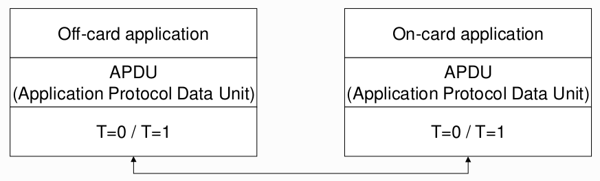

##### T=0 and T=1

- T=0 -» Each byte transmitted separately. Slower
- T=1 -» Blocks of bytes transmitted. Faster
- ATR -» Response of the card to a reset operation. Reports the protocol expected by the card

#### Encoding Objects in Smartcards

- Tag-Length-Value (TLV)
  - Object description with a tag value, the length of its contents and the contents
  - Each element of TLV is encoded according with ASN.1 BER
- Values can obtain other TLV objects, Recursive structure

### File System

- **File Identification - **Name or number
- **File Types **
  - Master File (MF) -» File system root
  - Dedicated File (DF) -» Similar to a directory
  - Elementary File (EF) -» Ordinary data file. File size fixed and determined when created
- **File System Types**
  - Transparent -» Data blocks identified by offset + length
  - Fixed Records -» Indexed records
  - Variable Records -» Indexed records
  - Cyclic -» Read Pointer, write pointer. Cyclic increments
- **Access Control**
  - No restrictions
  - Protected -» The file access APDU must contain a MAC computed with a key shared between the card and the off-card application
  - External authentication -» The file accesss APDU is only alowed if the card already checked the existence of a common shared key with the off-card application. Previous login

### Cryptographic Protocols

##### External Authentication

- The smartcard authenticates the off-card application
- Challenge-response protocol with a random number. Initiated by the off-card app

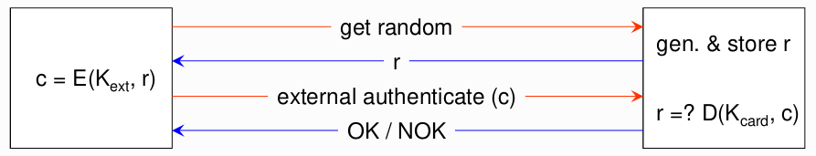

**Internal Authentication**

- The off-card application authenticates the smartcard
- Challenge-response protocol with a random number and key number. Initiated by the off-card app

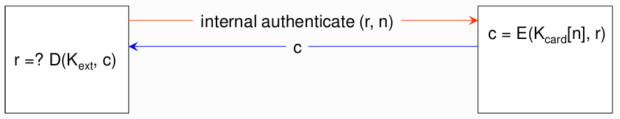

##### Secure Messaging

- Protect data red from the smartcard
- Protect data written into the smartcard
- Authentication with MAC and data encryption

### OpenCard Framework (OCF)

- **Goal - **Facilitate the development of smartcard-based solutions
- **Parties**
  - Card Issuer -» Card initialization, personalization and issuing
  - Card OS provider -» Basic, lowest level card behavior
  - Card reader / terminal provider -» Interfaces that deal with reading/writting from/to cards
  - Application / service provider -» Development of off-card applications

## 10 - Authentication Protocols

**Authentication - **Proof that an entity has a claimed identity attribute

- Enable the enforcement of authorization policies and mechanisms
  - Authorization -» Authentication

#### Requirements

- **Trustworthiness - **How good is it in providing the identity of an entity? Level of Assurance
- **Secrecy - **No disclosure of secrets used by legitimate entities
- **Robustness - **Prevent attacks to the protocol data exchanges, online DoS, offline dictionary attacks
- **Simplicity - **Should be as simple as possible to prevent entities from choosing dangerous shortcuts
- **Vulnerabilities introduced by people**

#### Approaches

- **Direct approach - **Provide credentials. Wait for verdict
- **Challenge-Response approach - **Get challenge. Provide a response computed from the challenge and the credentials. Wait for veredict

### Direct Approaches

#### Direct Approach w/ known Password

- A password is matched with a **stored** value. For a claimed identity (username)
- Personal stored value. Transformed by a **unidirectional** function
- **Advantage**
  - Simple
- **Problems**
  - Usage if **weak keys** enable dictionary attacks

#### Direct Approach with Biometrics

- **Biometric Samples - **Fingerprint, face geometrics, voice timber, manual writing, etc.
- **Biometric References - **Registered in the system with a previous enrolment procedure
- **Advantages**
  - Convenient
  - People cannot chose weak passwords
- **Problems**
  - Still being improved. Can be easily cheated
  - People cannot change their credentials
  - Can be risky for people
  - Tuning is mainly performed with the target population. Not with attackers

#### Direct Approach with One-Time Passwords

- Passwords that can be used just once
- Bank codes, SMS, email, twitter, etc.
- **Advantage**
  - They can be eavesdropped, nevertheless attackers cannot impersonate the password owner
- **Problems**
  - Interactors need to know which password they should use at different occasions
  - People may need to use extra resources to maintain or generate one-time passwords

##### RSA SecurID

- Personal authentication token
- It generates a **unique number** at a fixed rate
  - Usually one per minute (30 seconds)
  - Bound to a person (**User ID**)
  - **Unique number** computed with
    - A **64-bit key** stored in the card
    - The actual date
    - Proprietary digest algorithm
- **One-Time password** authentication
  - A person generates an OTP combining a User ID with the current token number
- An RSA ACE Server does the same and checks if they **match**
  - It also knows the person's key stored in the token
- Robust against dictionary attacks. Keys are not selected by people

### Challenge-Response Approach

- The authenticator provides a challenge
- The entity being authenticated transforms the challenge using its authenticated credentials
- The result is sent to the authenticator
- The authenticator produces a similar result and checks if they match
- **Advantage**
  - Authentication credentials are not exposed
- **Problems**
  - People may require means to compute responses
  - The authenticator may have to have access to shared secrets
  - Offline dictionary attacks

#### Challenge-Response with Smartcards

- **Authentication credentials**
  - The smartcard
  - The private key stored in the smartcard
  - The PIN to unlock the private key
- **The authenticator knows**
  - The corresponding public key or some personal identifier

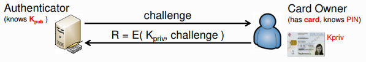

- **Signature-Based Protocol**
  - The authenticator generates a random challenge (value)
  - The card owner ciphers the challenge with their private key
  - The authenticator decrypts the result with the public key

#### Challenge-Response with Memorized Password

- **Authentication credentials**
  - Passwords selected by people
- **The authenticator know**
  - All registered passwords or
  - A transformation of each password (**preferable**)
- **Challenge-response protocol**
  - The authenticator generates a random challenge
  - The person computes a transformation of the challenge and password
  - The authenticator does the same (or the inverse)
  - **Examples** - CHAP, MS-CHAP v1/v2, S/key

##### PAP (PPP Authentication Protocol)

- Simple UID/password presentation
- Insecure cleartext password transmission

##### CHAP (Challenge Response Authentication Protocol)

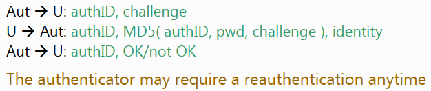

##### MS-CHAP (Microsoft CHAP)

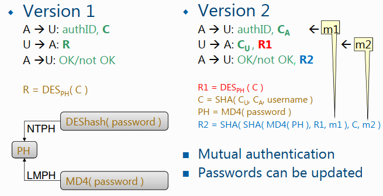

#### S/Key

- **Authentication credentials**
  - A password (**pwd**)
- **The authenticator knows**
  - The last used one-time password (**OTP**)
  - The last used OTP **index**
  - A **seed** value for the each person's OTPs

**Authenticator setup**

- The authenticator defines a random **seed**
- The person generates an **initial OTP** as

- The authenticator stores **seed**, **n** and **OTP** as authentication credentials

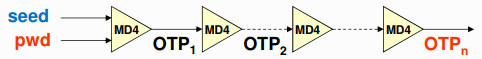

- The authenticator sends **seed** and **index** of the person as a challenge
- The person generates **index-1** OTPs in a row
  - And selects the last one as result
- The authenticator computes **h (result)** and compares the result with the stored **OTPindex**

#### Challenge-Response with Shared Key

- Uses a shared key instead of a password
  - More robust against dictionary attacks
  - Requires some token to store the key

#### GSM

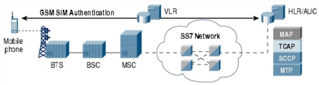

- Based on a secret key shared between the HLR and the Mobile Phone

##### Mobile Phone Authentication

- MSC fetches trio from HLR
  - RAND, SRES, Kc
- HLR generates RAND and corresponding trio using subscriber's Ki

****

#### Host Authentication

- **By name or address**
  - DNS name, IP address, MAC address
  - Extremely weak, no cryptographic proofs
- **With cryptographic keys**
  - Keys shared among peers
  - Per-host asymmetric key pair

#### Service / Server Authentication

- **Host authentication**
  - All co-located services / servers are indirectly authenticated
- **Per-service / server credentials**
  - Shared keys
  - Per-service / server asymmetric key pair

#### TLS (Transport Layer Security)

- Secure communication protocol over TCP/IP
- **Security mechanisms**
  - Communication confidentiality and integrity
  - Authentication of communication endpoints

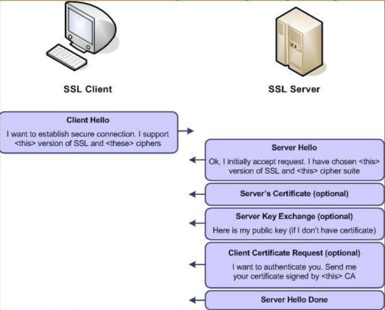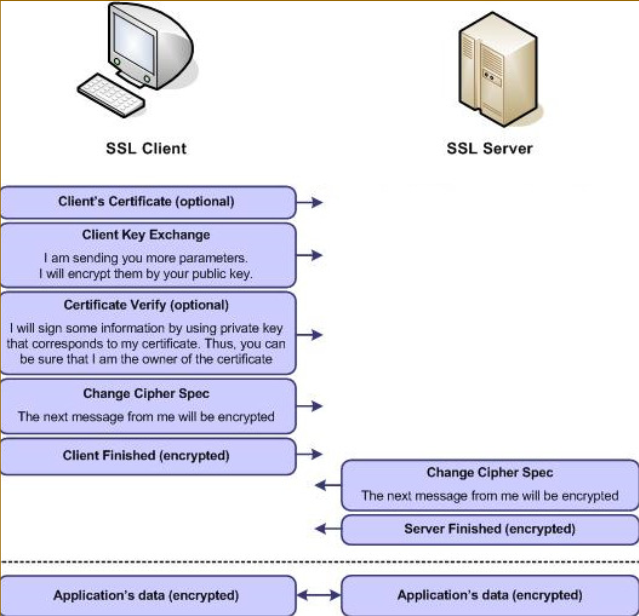

#### SSH (Secure Shell)

- Manages secure consoles over TCP/IP
- **Security mechanisms**
  - Communication confidentiality and integrity
  - Authentication of communication endpoints
- **Authentication mechanisms**
  - **Server** - with asymmetric keys pair
    - Inline public key distribution. Not certified!
    - Clients cache previously use public keys
  - **Client** - configurable
    - Username + password
    - Username + private key

****

**Authentication Metaprotocols - **Generic authentication protocols that encapsulate other specific authentication protocols

**Single Sign-On (SSO) - **Unique, centralized authentication for a set of federated services

- The identity of a client, upon authentication, is given to all federated services
- The identity attributes given to each service may vary
- The authenticator is called **Identity Provider (IdP)**

## 11 - Pluggable Authentication Modules

- **Users - **Unification of authentication mechanisms for different applications
- **Manufacturers - **Authenticated access to services independently of the authentication mechanism
- **Administrators - **Management and matching of N authentication mechanisms for M services requiring client authentication

#### Problems

- Services requiring client authentication use **hardcoded** mechanisms
- The services that implement authentication mechanisms use **hardcoded** options
- **Not easy** to integrate several authentication mechanisms
- Different services  may require different authentication mechanisms

### PAM Goals

- Default mechanism per host. Administrator able to choose and configure default mechanism
- Application-specific mechanisms. Application should be able to exploit different mechanisms
- Several Interface approaches. Access to special devices
- Several authentication protocols

****

- Simplicity. Stacking of mechanisms
- Increased security. Multi-factor authentication
- Services don't need to be changed
- Modular architecture. Dynamic loading of required modules

#### Classic Unix Authentication

- Request Information - **username + password**
- Validation
  - Existence of an active account
  - Ciphered password
  - Comparison of the provided password with the content of the ciphered password
- Obtained credentials

### PAM Architecture

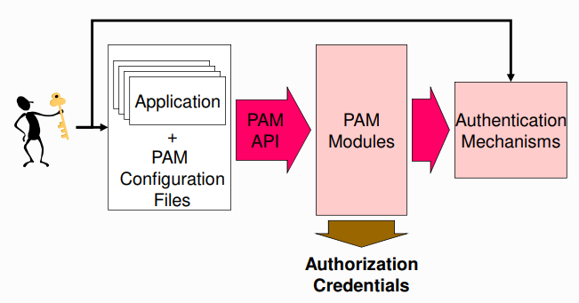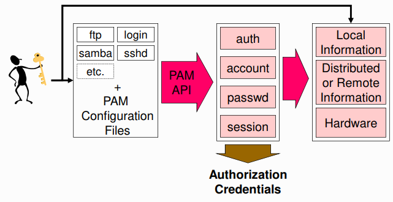

### PAM Actions

- **Authentication (auth) -** Identity Verification
- **Account Management (account) -** Enforcement of access policies based on account properties
- **Password Management (password) -** Control of the password modification process
- **Session Management (session) -** Verification of operational / session parameters

### PAM Modules

- **Standard API**
  - Functions provided by modules are invoked
  - Decision based on the status code
- **Dynamically loaded** (shared libraries)
- Modules can be used for **one or more actions**

### PAM Configuration Files

- Typically, **one per PAM client** application
- Specify **how** the actions should be applied
  - Which mechanisms / parameters to use
- Each module uses a particular **set of resources**

### PAM lib

- **Star / end** of the PAM lib - pam_start() | pam_end()
- Execution of PAM actions
  - Defined a **stack of modules** per action
    - All modules in the stack are executed from **top to bottom**
    - Each module has its own parameters and **calling semantic** 
      - required, requisite, sufficient, optional
  - Execution proceeds until the **end**, or **failure**
  - Applications can **recover** from failures

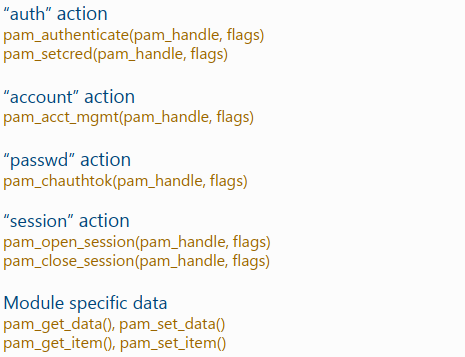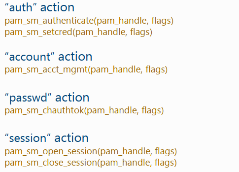

### Success Control

- Control is specified for each action and module
  - **requisite - **If the module fails, the result is returned immediately
  - **required - **If the module fails, the result is set but following modules are called
  - **sufficient - **If the module is successful, returns successful. If fails, result is ignored
  - **optional - **Result is ignored 

## 12 - Access Control Modules

### Access Types

- **Definition - ** The policies and mechanisms that mediate the access of a subject to an object

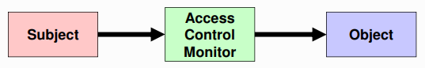

- **Requirements - **Authentication. Authorization. Accountability
- **Subjects and Objects**
  - Both digital entitles
  - Subjects can be **something exhibiting activity - **Processes, Computers, Networks
  - Objects can be **the target of an action - **Stored data, CPU time, Memory, same of subjects
- An entity can be **both subject and object**

#### Lest Privilege Principle

Every program and every user of the system should operate using the least set of privileges necessary to complete the job

- **Privilege - **Authorization to perform a given task. Access control clearance
- Each subject should have the exact priviliges required to the assigned tasks
  - Less privileges that the required create unsurpassable barriers
  - More privileges that the required create vulnerabilities

#### Access Control Models

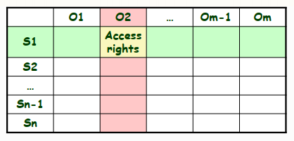

- **Access control matrix**
  - Matrix with all access rights for subjects relatively to objects
- **ACL-based mechanisms**
  - Access Control List (matrix column)
    - List of access rights for specific subjects
    - Access rights can be positive or negative
  - Usually ACLs are stored along with objects
- **Capability-based mechanisms**
  - Capability. Unforgeable authorization token (matrix row)
    - Contains object references and access rights
  - Access granting
  - Usually capabilities are kept by subjects

#### Access Control Kinds

- **Mandatory access control (MAC)**
  - Access control policy statically implemented by the access control monitor
  - Access control rights cannot be tailored by subjects or object owners
- **Discretionary access control (DAC)**
  - Some subjects can update rights granted or denied to other subjects for a given object
- **Role-based Access Control (RBAC)**
  - **Not DAC or MAC** - Roles are dynamically assigned to subjects
  - Access control binds roles to (meaningful) **operations**
    - Operations are complex, meaningful system transactions
    - Operations can involve many individual lower-level objects

### Role-based Access control (RBAC)

#### Rules

- **Role Assignment**
  - All subject activity on the system is conducted through transactions (allowed to specific roles)
  - A subject can execute a transaction if it has selected or been assigned a role which can use the transaction
- **Role Authorization**
  - A subject's active role must be authorized for the subject
- **Transaction Authorization**
  - A subject can execute a transaction if
    - The transaction is authorized through the subject's role memberships
    - There are no other constrains that may be applied across subjects, roles, and permissions

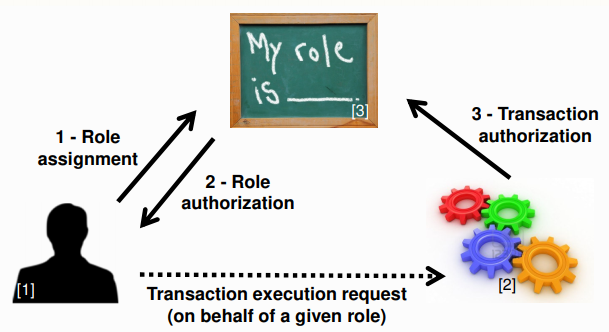

#### Roles vs Groups

- **Roles are a collection of permissions**
  - Permissions are granted to the subjects that play the role
  - Subjects can only play 1 role at a given time
- **Groups are a collection of users**
  - Permissions can be granted both to users and groups
  - Subjects can belong to many groups at a given time
- **Session concept**
  - Role assignment is similar to a session activation
  - Group membership is a static attribute

#### RBAC Variants

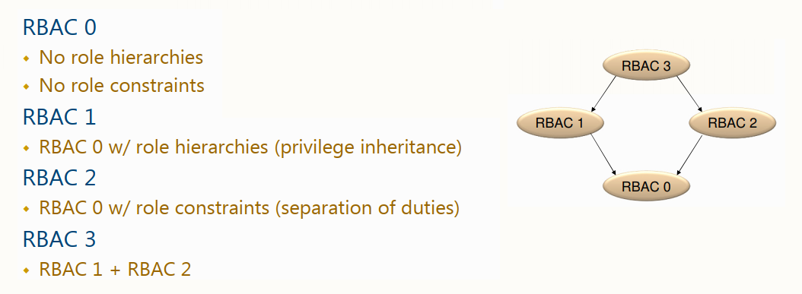

#### NIST RBAC Model

- **Flat RBAC** - Simple RBAC model w/ user-role review
- **Hierarchical RBAC** - Flat RBAC w/ role hierarchies
- **Constraint RBAC** - RBAC w/ role constraints for separation of duty
- **Symmetric RBAC** - RBAC w/ permission-role review

### Context-Based Access Control (CBAC)

- Access rights have an **historical context**
  - The access rights cannot be determined without reasoning about past access operations
- **Chinese Wall policy**
  - Conflict groups
  - Access control policies need to address past accesses to objects in different members of conflict groups

### Attribute-Based Access Control (ABAC)

- Access control decisions are made based on attributes associated with relevant entities
- **OASIS XACML** (eXtensible Access Control Markup Language) architecture
  - **Policy Administration Point (PAP) -** Where policies are managed
  - **Policy decision Point (PDP) -** Where authorization decisions are evaluated and issued
  - **Policy Enforcement Point (PEP) -** Where access requests to a resource are intercepted and confronted with PDP's decisions
  - **Policy Information Point (PIP) -** Provides external information to a PDP

##### Access control with PEP and PDP

- A subject sends a **request**
  - Which is intercepted by the Policy Enforcement Point (PEP)
- The PEP sends the authorization request to the Policy Decision Point (PDP)
- The PDP evaluates the authorization request against its policies and reaches a decision
  - Which is returned to the PEP

> Policies are retrieved from a Policy Retrieval Point (PRP)
>
> Useful attributes are fetched from Policy Information Points (PIP)
>
> Policies are managed by the Policy Administration Point (PAP)

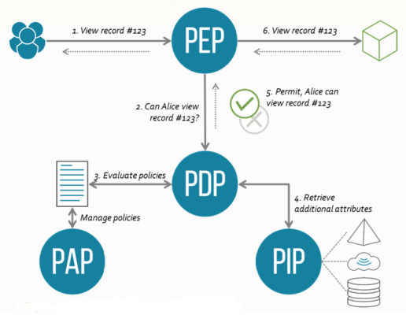

****

#### Break the Glass Access Control Model

- In some scenarios it may be required to overcome the established access limitations
- Subject may be presented with a break the glass decision upon a deny
  - Can overcome the deny at their own responsibility
  - Logging is fundamental to prevent abuses

#### Separation of Duties

- Fundamental security **requirement** for fraud and error **prevention**	
  - Dissemination of tasks and privileges for a specific business process among multiple subjects
- **Damage control**
  - Segregation of duties helps reducing the potential damage from the actions of one person
  - Some duties should not be combined into one position

#### Information Flow Models

- Authorization is applied to **data flows**
  - Considering the data flow source and destination
  - Avoid unwanted / dangerous information flows

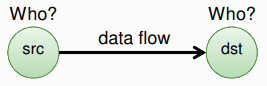

- **Src** and **Dst** security-level attributes
  - Information flows should occur only between entities with given **security-level** attributes
  - Authorization is given based on the security-level attributes

#### Multilevel Security

- Subjects (or roles) act on different **security levels**
  - Levels do not intersect themselves and have some partial order
- **Levels** are used as **attributes** of subjects and objects
  - Subjects - security level clearance
  - Objects - security classification
- Information flows & security levels
  - Same security level -» authorized
  - Different security levels -» controlled

### Security Categories

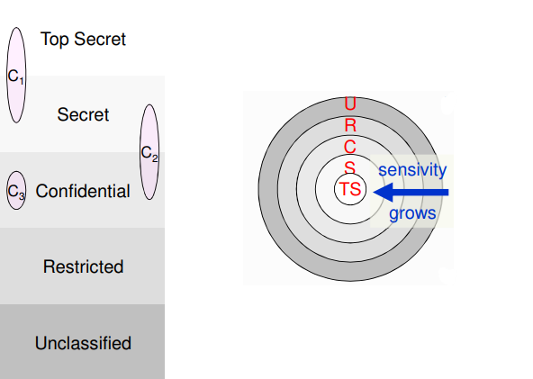

- **Self-contained** information environments
  - May span several security levels
- **Military environments - **Military branches, military units
- **Civil environments - **Departments, organizational units
- Object can belong to different compartments and have different security classification in each of them

#### Security Labels

- Label = Category + Level
- Relative order between labels

### Bell-La Padula MLS Model

- Access control policy for **controlling** information **flows**
  - Addresses data confidentiality and access to classified information
  - Addresses disclosure of classified information
- Uses a **state-transition** model
  - In each state there are subjects, objects, an access matrix and the current access information
  - State transition rules
  - **Security levels** and clearances

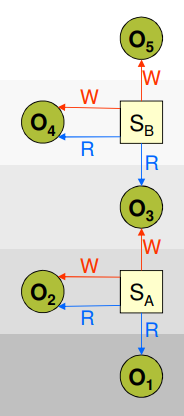

- S can read O iff L(S) ≥ L(O)  (no read up)
- S can write O iff L(S) ≤  L(O)   (no write down)

### Biba Integrity Model

- Access control policy for controlling information flows
  - For enforcing data integrity control
  - Uses **integrity levels**, not **security levels**
- Similar to Bell-La Padula, with inverse rules

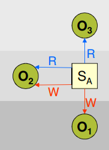

- S can read O iff I(S) ≤ I(O)
- S can write O iff I(S) ≥ I(O)

### Clark-Wilson Integrity Model

- Addresses information **integrity control**
  - Uses the notion of transactional data transformations
  - Separation of duty - transaction certifiers ≠ implementers
- **Terminology**
  - Data Items
    - Constrained Data Items (**CDI**)
    - Unconstrained Data Items (**UDI**)
  - Integrity Policy Procedures
    - Integrity Verification Procedure (**IVP**)
    - Transformation Procedure (**TP**)
- **Integrity Assurance**
  - Certification
  - Enforcement
- **Two sets of rules**
  - Certification Rules (C)
  - Enforcement Rules (E)

#### Certification and Enforcement Rules

- **Basic Rules**
  - **C1 - **When an IVP is executed, it must ensure that all CDIs are valid
  - **C2 - **For some associated set of CDIs, a TP must transform thise CDIs form one valid state to another
  - **E1 - **The sytem must maintain a list od certified relations and ensure only TPs certified to run on a CDI, change that CDI
- **Separation of Duty**
  - **E2 - **The system must associate a user with each TP and set od CDIs. The TP may access CDIs on behalf oh the user if authorized
  - **C3 - **Allowed user-TP-CDI relations must meet "separation of duty" requirements
- **Identification Gathering**
  - **E3 - **The system must authenticate every user attempting a TP
- **Audit Trail**
  - **C4 - **All TPs must append to a log enough information to reconstruct operations
- **UDI Processing**
  - **C5 - **A TP taking a UDI as input may only perform valid transactions for all possibel values of the UDI. The TP will either accept or reject the UDI
- **Certification Constraints**
  - **E4 - **Only the certifier of a TP may change the associated list of entities

## 13 - Security in Operating Systems

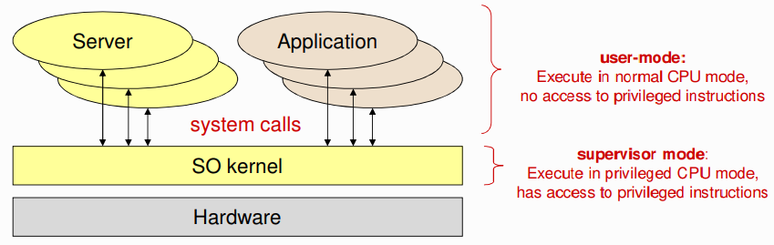

- **Kernel mission**
  - Virtualize the hardware
  - Enforce protection policies and provide protection mechanisms

#### Execution Rings

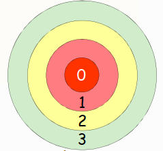

- Different levels of privilege. Used by CPU's to prevent non-privilege code from running opcodes
- Processors have 4 rings. OS's only use 2
- Transfer of control between rings require special gates

#### Virtual Machines and Hypervisors

- Emulation of a particular (virtual) hardware with the existing one (real)
- **Hosted virtualization**
  - The hypervisor is a process of a given OS (host OS)
  - Software-based virtualization
  - Direct execution of guest user-mode code
- **Bare-metal virtualization**
  - The hypervisor runs on top of the host hardware
  - Full virtualization
  - There is a ring -1 below ring 0

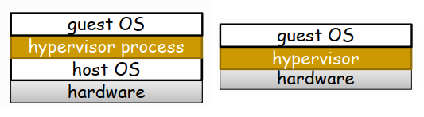

### Computational Models

- Set of entities (objects) managed by the OS kernel
  - User identifiers
  - Processes 
  - Virtual memory
  - Files and File Systems
  - Physical devices

#### User Identifiers

- For the OS kernel, a user is a number. **User ID (UID)**. Establish during login
- All activities are executed on a computer on behalf of a UID
  - The UID allows the kernel to assert what is allowed / denied to processes
  - **Linux - **UID 0 is omnipotent (root)
  - **Windows - **Concept of privileges

#### Group Identifiers

- Groups also have an identifier
  - A group is a set of users. **Group ID (GID)**
  - A group can be defined by including other groups
- A user can belong to several groups
  - **Rights** = UID rights + rights of his groups
- In Linux all activities are executed on behalf of a set of groups
  - Primary group. Secondary groups

#### Processes

- A **process** defines the context of an activity
- Security-related context
  - Identity (UID and GIDs) - Enforcing access control
  - Resources being used - Open files. Reserved virtual memory areas

### Access Control Monitor

- The OS kernel is an **access control monitor**
  - Controls all interactions with the hardware
  - Controls all interactions between entities of the computational model
- **Subjects -** Usually local processes

#### Mandatory Access Controls

- OS kernels have plenty mandatory access control policies
  - Cannot be overruled not even by administrators
- Kernel runs in CPU privileged modes, user applications run in non-privileged modes
- Separation of virtual memory areas
- Inter-process signaling

#### Protection with ACLS

- Each object has an ACL - It says which subjects can do what
- An ACL can be discretionary or mandatory
  - When mandatory it cannot be modifed
  - When discretionary it can be tailored
- An ACL is checked when an activity, on behalf of a subject, wants to manipulate the object

#### Protection with Capabilities

- Less common in normal OS kernels
- Open file descriptors
  - Application's processes indirectly manipulate open file descriptors through the OS kernel
  - Open file descriptors can only be granted to other processes through the OS kernel

##### Unix file protection ACLs

- Each file system object has an ACL
  - Binding 3 rights to 3 subjects
  - Only the owner can update the ACL
- **Rights -** R W X
- **Subjects -** UID GID Others

##### Windows NTFS file protection

- Each file system object has an ACL and a owner
  - The ACL grants 14 types of access rights to a variable-size list of subjects
  - Owner can be an UID or a GID
  - Owner has no special rights over an ACL
- **Rights -** A bunch of them
- **Subjects -** UID GID

### Privilege Elevation

#### Set-UID mechanism

- Used to change the UID of a process running a program stored on a Set-UID file
  - If the program file is owned by UID X and the set-UID ACL bit is set, then it will be executed in a process with UID X, independently of the UID of the subject that executes the program
- Used to provide privileged programs for running administration task invoked by normal users
- **Real UID - **UID of the process creator
- **Effective UID - **UID of the process

#### sudo mechanism

- Administration by root is not advertised. One identity, many people
- Administration role (UID = 0). Many users assume it
- sudo is a Set-UID application with UID = 0
- Appropriate logging can take place in each command run with sudo

#### chroot mechanism

- Used to reduce the visibility of a file system
  - Each process descriptor has a root i-node number
  - chroot changes it to an arbitrary directory
- Used to protect the file system from potentially problematic applications. Not bullet proof

### Linux Login

#### Not an OS kernel operation

- A privileged login application presents a login interface for getting users credentials
- The login application validates the credentials and fetches the appropriate UID and GIDs for the user
- All processes created by the user have its identifiers

****

- The login process must be a privileged process. Arbitrary UID and GIDs

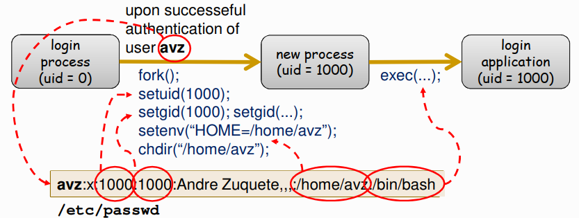

#### Process validation process

- Username is used to fetch a UID/GID pair form **/etc/passwd**
- Supplied password is transformed using a digest function
- The result is checked against a value stored in **/etc/shadow**
  - Indexed by the username
  - If they match, the user was correctly authenticated
- File protections
  - **/etc/passwd** and **/etc/group** can be read by anyone
  - **/etc/shadow** can only be read by root

## 14 - Secure Data Storage

### Problems

- **The classical file system protection is limited**
  - Physical protection assumptions. Physical confinement of storage devices
  - Logical protection assumptions. Proper use of ACLs or other authorization mechanisms
- **Numerous scenarios where this protection is useless**
  - Direct / physical access to storage devices
  - Bypassing of logical access control mechanisms
- **Distributed access raises security issues**
  - Trust in (unknown) administration teams
  - Remote authentication of users
  - Secure communications

### Solution

#### File Encryption

- Encryption / decryption of files contents
  - Can safely circulate along dangerous networks
  - Can safely be stored in insecure storage devices
- **Problems**
  - **Data retrieval -** End users cannot loose encryption/decryption keys
  - **File sharing -** Implies key sharing
  - **Backups -** Interference with regular storage administration procedures

#### Ideal Architecture

- **Cipher / decipher transparency**
  - At the application level
  - At the OS file caches level
- **Visibility of securely stored data**
  - Visual awareness. Of what is protected and not protected
  - Automatic setting of encryption attributes
- **Easy sharing of encrypted data**
- **Decryption capacity** under special circumstances by authorized people

### Current Aproaches

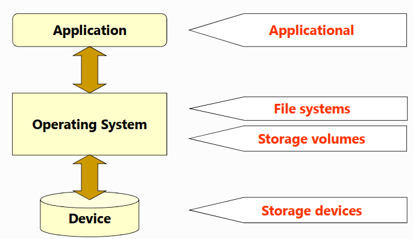

#### Applicational

- Data transformed by autonomous applications. No integration with other applications
- There are vulnerability windows
- Data can be transformed with different algorithms
- Hard to share data without sharing keys

#### Storage Volumes / Devices

- Cipher / decipher operations at the volume / device level
  - Total transparency for applications and possibly to the OS
  - Cannot differentiate accesses by different users
- Cannot solve issues raised by distributed file systems

#### File Systems

- Data is transformed in the **path** between storage devices and the memory of applications
  - **Storage device «-» File cache**
    - No protection for remote accesses
  - **File cache «-» Memory of applications**
    - Protection for remote accesses
- **Limitations**
  - File system integrity must be preserved
    - Some file attributes cannot be hidden
  - Attributes that **can** be easily be hidden
    - Arbitrary file / directory names
    - File contents
  - Attributes that **cannot** be hidden / changed
    - Object types
    - Contents of directories
    - Well-defined names - "." and ".."
    - Dates, Dimension, Ownership
- **Practical encryption issues**
  - Uniform random access to encrypted data
  - Confidentiality
    - Not advised to use the same key for different files
    - Not advised to use the same key for an entire file
    - Stream ciphers are not advised w/ the same key for different files

### CFS (Cryptographic File System)

- **NFS extension**
  - OS «-» local CFS server «-» local or remote NFS server
- **Encryption / decryption operations**
  - Performed by the **local CFS server**
    - Files circulate encrypted in the network
    - Decrypted file contents are maintained in the client OS file cache
  - Cipher / decipher keys **supplied** per each mount point
    - Communication to the local CFS server by a modified mount command
    - The command uses the new MOUNT interface

****

- **Encrypts file names and file contents**
  - Using 2 keys derived from a password
- **Name**
  - Concatenated with an integrity control value. Encryption with ECB
- **File Contents**
  - Computes with cenas

### EFS (Encrypted File System)

- Windows NTFS extension
- **Functionality**
  - Each user is bound to an asymmetric key pair
  - Each file is encrypted with a unique symmetric key. FEK (File Encryption Key)
  - An encrypted file can be accessed by many users
    - For each file EFS stores a copy of FEK encrypted with the public key of each authorized user
    - Encrypted FEKs are stored in a STREAM associated to the file
  - Each encrypted file is clearly visible
- **Algorithms**
  - Asymmetric encryption of FEKs - RSA
  - Symmetric encryption with FEKs - DESX
- **Problems**
  - Asymetric key pairs are stores in disk
    - Illegitimate access by admins
  - Files are decrypted by servers
    - No network protection

## 15 - Database Security

### Advantages of using Databases

- Shared access
- Minimal redundancy
- Data concistency
- Data integrity
- Controlled access

### Security Requirements

- **Physical integrity - **Immunity to physical problems
- **Logical integrity - **Data structure is preserved
- **Element integrity - **Data in each element is accurate
- **Auditability - **Possible to track who or what has accessed which elements in the database
- **Access control - **A user / role is allowed to access only authorized data / queries
- **User Authentication - **Every user / role is positively identified. Fundamental for audit trails
- **Availability - **Users / roles can access the DB in general and all the data for which they are authorized

#### Two-Phase Updates

- **Problem**
  - Failures during updates may render databases incoherent
  - BDMS require ACID properties
    - **Atomicity - **Entire transaction happens or not
    - **Consistency - **The DB state must be consistent after transactions
    - **Isolation - **Concurrent transactions do not interfere with each other
    - **Durability - **Changes occur even in the presence of failures
- **Solution - **Two-phase updates

****

- **1st Phase - **intent phase
  - The DBMS gathers resources it needs to perform the update
  - Does everything to prepare for the update, but makes no changes to the database
  - Writes commit flag to the database
- **2nd Phase - **commit phase
  - Makes the permanent changes in the database
  - It lasts until finishing all changes prepared in the first phase
  - When it finished, the database changed to a new, stable and coherent state

#### Redundancy / Internal consistency

- **Error detection and correction codes -** Parity bits, Hamming codes, cyclic redundancy checks
- **Shadow fields -** Duplication of fields or records

#### Concurrency / Consistency

- **Accesses by two users** of the same DBMS must be **constrained** so that neither interferes with each other
  - **Locking -** Multiple readers, one writer. Not enough
- **Solution**
  - Treat every query-update cycle as a single atomic operation
  - Synchronization should be applied to transactions

#### Monitors

- DBMS unit responsible for the DB structural integrity. Checks entered values to ensure consistency
- Types of monitors
  - **Range comparisons - **Tests if values belong to an acceptable range
  - **State constraints - **Describe the condition of the entire database
  - **Transition constraints - **Describe required conditions before changing the database

#### Database Activity Monitoring

- **DBMS usage supervision - **Detect abuses. Unusual / suspect activity or operations
- **DBMS independent - **Not part of the DBMS. External observation DBMS activity
- **Monitoring sensors - **Network activity. Log commands

#### Sensitive Data

- **Data requiring extra protection -** From loss, misuse, modification, unauthorized access
- Some databases contain sensitive data
- **Sensitivity** depends on BD purpose + DB data
  - Some record fields, entire records / tables, entire database
- **Complexity**
  - Simple cases - all sensitive or nothing sensitive
  - Complicated cases - part of the DB elements are sensitive
- **Factors that make data sensitive**
  - **Inherently sensitive -** The value itself may be so revealing that it is sensitive
  - **From a sensitive source -** May reveal its identity
  - **Declared sensitive**
  - **Belongs to a sensitive record**
  - **Sensitive given previously disclosed information -** Together with other data can be sensitive

#### General Data Protection Regulation (GDPR)

- **Personal data**
  - Data that can be unequivocally linked to a individual
  - Links can be provided by unique identifiers or sets of quasi-identifiers

#### Laws for the protection of personal data

- No global consensus
- In Portugal this is supervised by CNPD

#### Types of Disclosures

- **Exact data - **The exact value of a sensitive datum. Most serious disclosure
- **Bounds - **Sensitive data is > lower bound or < upper bound. Used to protect sensitive data
- **Negative result - **By getting a negative result for a query on a sensitive value, a user can conclude that the value has a particular set of values
- **Existence - **The existence of a sensitive field in a record can be, by itself, sensitive information
- **Probable value - **Crossing the results of several queries we can infer a probability for an element value

#### Inference Attacks

- A way to extract, or derive, sensitive information from non-sensitive information
- Assuming that there is no free access to the entire data repository
- **Direct Attack - **Uses queries with a blend of selection rules that use sensitive and non-sensitive fields
- **Indirect Attack - **Inference of particular values from statistical values computed over several records
- **Tracker Attack - **The database may conceal data when a small number of records make up the large proportion of the data revealed. A tracker can fool the DBMS

#### K-Anonymity

- No query can deliver an **anonymity set** with less that **k** entries
- The **anonymity set** is the set of all possible subjects
- **Privacy-critical attributes**
  - Unique indentifiers
  - Quasi-identifiers
  - Sensitive attributes

### Multilevel Security

#### Goals

- Tag information item with security classifications (unclassified, confidential, secret, top secret)
- Tag queries with security levels
- Prevent queries from observing values or fields with a different security classification

#### Poli-instanciation

- A record with a particular key field may be duplicated in different security levels
- This reduces the precision of the database information
- The correctness of the information depends on the entity performing the query

#### Separation Strategies

- **Partitioning - **Different security levels, different databases. Queries are directed to the DBs
  - **Advantages - **Easy to implement
  - **Disadvantages -** Redundancy of information. Problems with fields with different security levels
- **Encryption - **Fields are encrypted with a security-level key
  - **Advantages - **Single database, same database structure
  - **Disadvantages - **Decryption on each query with the adequate security level key
- **Integrity Lock - **Each data item is formed by 3 parts (Data item, Sensitivity label, Checksum). The label should be Unforgeable, Unique and Concealed
  - **Advantages - **Can use a regular DBMS. Trusted stored procedures are enough to implement them
  - **Disadvantages - **Space for storing sensitivity labels and checksum

## 16 - JVM Security

- **Java Virtual Machine (JVM)**
  - Java programs are implemented by a set of Java classes
  - Secure sandbox for executing Java programs
- **Security Capabilities**
  - Easily configurable security policy
  - Easily extensible access control structure
  - Extension of security checks to all Java programs

#### JVM Sandbox Model

- Creates a **barrier** around a Java execution environment
  - Applications are executed within the sandbox bounds
  - Cannot affect resources outside the sandbox
- **Basic rules of sandbox**
  - Remote resource protection - Enforced by remote system
  - Local resource protection - Enforced by local security manager
  - JVM code and data protection - Enforced by static and dynamic checking

#### Java Byte Code

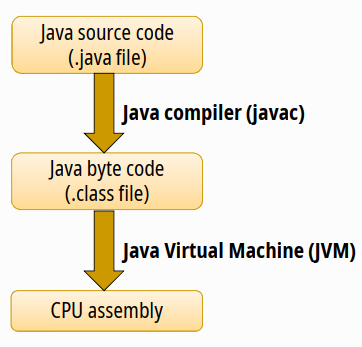

- One cannot assume that byte codes are produced by a correct compiler
- JVM must tackle wrong or malicious byte codes

#### Java Runtime Environment (JRE)

- **Loads required classes - **Usually upon a class method invocatoin
- **Verifies the correctness of loaded classes - **Checks consistency and integrity
- **Compiles bytecodes - **Only for invoked methods
- **Correct memory management - **Memory allocation when needed. Garbage collection
- **Checks the correct execution of classes code**
  - Runtime integrity validations - Null pointer. Type checking
  - Runtime security validations - Access control
- **Confinement - **Isolation of Protection Domains

#### Protection Domain

- A set of classes whose instances are granted the same set of permissions
- JRE maintains a mapping from code 8 (classes and instances) to their protection domains

#### Permissions

- Definitions of what is allowed or denied. Subclasses of interface **java.security.Permission**
- **BasicPermission - **Hierarchical name and arbitrary action
- **FilePermission - **Pathname & action (read, write, execute, delete)
- **SocketPermission - **Host, port & action (accept, connect, listen, resolve)

#### Security Policies

- Each JRE maintains an installed security policy. Determines the set of granted/denied authorizations
- **Installed policy**
  - There is always a policy installed (**Policy Policy.getPolicy()**)
    - JRE includes a default policy reference implementation
  - Can be overwritten (**void Policy.setPolicy()**)
    - Requires permission

#### Security Manager

- At most **one per JVM**
- Enforces a security policy for an application
- Check whether an action is allowed before requesting it
- Class **SecurityManager** of **java.lang** - Default runtime security manager. Can be redefined
  - Many **checkXXX** methods

#### Access Controller

- Abstract class used to decide whether an access to a critical system resource is to be allowed or denied
- Mark code as being privileged
- Snapshot of the current calling context so access control decisions from a different context can be made with respect to the saved context

### Dynamic Class Loading

#### Class Loaders

- **Primordial class loader - **Critical part of VM. Prevents name spoofing of **java.*** library classes
- **Additional class loaders**
  - Defined by users / applications
    - Help application to locate and download classes contents
  - Each one defines separate namespace environment
    - Classes in one namespace cannot interact with classes in other namespaces
  - Allows different versions of same class name to co-exist
    - Typically associated with code from different origins

#### Overview

- **Class loading security policies**
  - No class loading of packages **java.*** other than from the canonical local repository. 
    - Primordial class loader ensures this
  - Classes from different network servers do not interact
    - Different domains
- **Class loading steps**
  - Locate the requested binary class
  - Parse / translate into internal data structures for emulation
  - Enforce the naming conventions
  - Check correctness of binary class
  - Perform any translation of code and metadata
  - Initialize memory and pass control to emulation engine

#### Class Loader Checks

- **File integrity check - **Magic number, proper formats used
- **Class integrity check - **Has superclass and is not final. No override of final superclass method
- **Bytecode integrity check - **Data-flows analysis. Stack checking
- **Runtime integrity checks - **Verifications on method calls

#### Subjects, Principals and Credentials

- **Subjects - **Aggregate info related with a single (authenticated) entity. Identities. Credentials
- **Principals - **Encapsulate identities. Bind names to subjects
- **Credentials - **Can be any kind of object