# BD: Trabalho Prático APF-T

**Grupo**: P2G6

- Marta Oliveira, MEC: 97613. Contribuição: 50%
- Eduardo Alves, MEC: 104179. Contribuição: 50%

## Introdução / Introduction

A indústria de jogos é uma das indústrias que mais cresce no mundo, e com o surgimento de jogos online e distribuição digital, a forma como compramos e vendemos jogos mudou ligeiramente.

Com isso em mente, escolhemos realizar um projeto que consiste numa loja online de compra e venda deste tipo de artigos.

O projeto tem como objetivo desenvolver uma base de dados que retrate o processo de compra de jogos. Iremos criar um banco de dados que inclua informações sobre jogos disponíveis, os seus preços e avaliações. Os clientes podem encontrar rapidamente os jogos que procuram e tomar decisões informadas de compra.

## ​Análise de Requisitos / Requirements

1. Procurar jogos através do seu nome

2. Procurar jogos através do seu género

3. Procurar jogos através da sua classificação

4. Permitir ao utilizador escolher o(s) seu(s) género(s) preferido(s) de jogos para que as sugestões de visualização sejam mais adequadas

5. Permitir que o utilizador avalie o vendedor após compra

6. Permitir que o utilizador pesquise jogos por plataforma

7. Permitir que o utilizador pesquise por vendedores que tenham a classificação mais elevada.

8. Pesquisar por "jogos em destaque", isto é, jogos mais vendidos.

9. Inserir ou remover utilizadores.

10. Ver detalhes de um jogo.

11. Colocar um jogo numa lista de favoritos (e ver essa lista)

## DER - Diagrama Entidade Relacionamento/Entity Relationship Diagram

### Versão final/Final version


### APFE

Não houveram alterações significativas desde a última entrega.

## ER - Esquema Relacional/Relational Schema

### Versão final/Final Version


### APFE

Não houveram alterações relativamente aos pedidos prévios.

## ​SQL DDL - Data Definition Language

[SQL DDL File](sql/01_ddl.sql "SQLFileQuestion")

## SQL DML - Data Manipulation Language

Uma secção por formulário.

### Formulario exemplo

## Registo utilizador

As seguintes queries permitem que um utilizador se registe na plataforma.
Visto que a nossa plataforma é baseada no ponto de vista do comprador, usamos a segunda query para definir o utilizador como comprador.

```sql
-- Show data on the form
string query1 = "INSERT INTO ONLINEGAMES_PLATFORM.UTILIZADOR (Email, Palavra_passe, NIF) VALUES (@Email, @Password, @NIF)";
SqlCommand command1 = new SqlCommand(query1, connection, transaction);
```

```sql
-- Show data on the form
string query2 = "INSERT INTO ONLINEGAMES_PLATFORM.Comprador (MORADA, NIF) VALUES (@MORADA, @NIF)";
```


## Login

Esta query representa o login que de acordo com os inputs "das caixas de texto do forms" verifica se o utilizador existe na base de dados.

```sql
-- Show data on the form
SqlCommand cmd = new SqlCommand("SELECT * FROM ONLINEGAMES_PLATFORM.UTILIZADOR where Email='" + textBox1.Text + "' and Palavra_passe='" + textBox2.Text + "'", cn);
```


Caso o utilizador exista na base de dados:

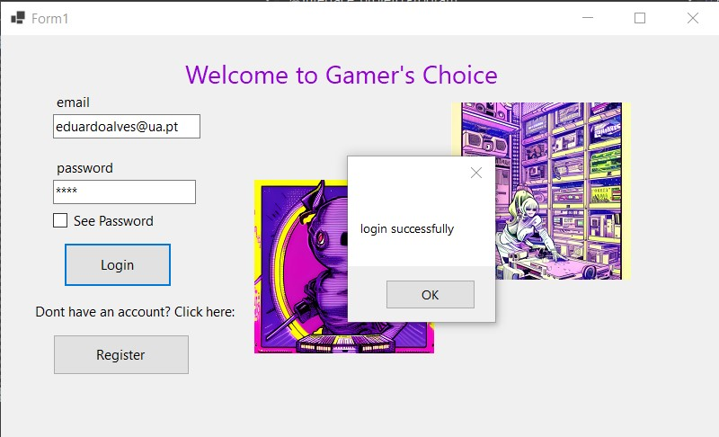

Caso o utilizador não exista na base de dados:


## Funcionalidade: Adicionar géneros favoritos

É possível ao utilizador associar um género de jogos preferidos para filtrar a pesquisa de jogos. Esse valor é adicionado à tabela género preferido.


```sql
string queryString = "INSERT INTO ONLINEGAMES_PLATFORM.GENERO_PREFERIDO (NIF_Comprador, Nome_Genero) VALUES (@NIF_Comprador, @Nome_Genero)";
```


## Remover Género Favorito
É possível também remover os géneros associados.
```sql
 string queryString = "DELETE FROM ONLINEGAMES_PLATFORM.GENERO_PREFERIDO WHERE NIF_Comprador = @NIF_Comprador AND Nome_Genero = @Nome_Genero";
```


## Password Change
Também está disponível alterar a palavra passe atual ao utilizador. Para isso é necessário colocar a palavra passe atual (e este valor estar correto) e inserir a nova palavra passe pretendida.

```sql
 string query = "UPDATE ONLINEGAMES_PLATFORM.UTILIZADOR SET Palavra_passe = @Password WHERE NIF = @NIF";
```

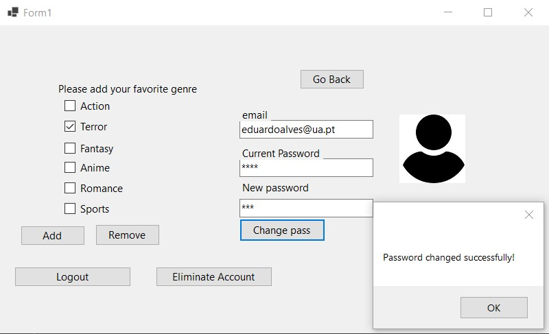

## Funcionalidade: Lista de jogos principal.

```sql
-- Show data on the form
 SqlCommand command1 = new SqlCommand("ONLINEGAMES_PLATFORM.GetJogos", connection);
```

```sql
CREATE PROCEDURE ONLINEGAMES_PLATFORM.GetJogos
AS
BEGIN
    SET NOCOUNT ON;

    SELECT
        J.ANUNCIO_ID AS [ID],
        J.STOCK,
        J.NOME AS [Name],
        J.NOME_PLATAFORMA AS Platform,
        J.PRECO AS Price,
        AV.AVALIACAO_VENDEDOR AS [Seller review],
        A.NIF_VENDEDOR AS [NIF Seller]
    FROM ONLINEGAMES_PLATFORM.JOGO J
    LEFT JOIN ONLINEGAMES_PLATFORM.ANUNCIOS A ON J.ANUNCIO_ID = A.ID
    LEFT JOIN ONLINEGAMES_PLATFORM.VENDEDOR V ON A.NIF_VENDEDOR = V.NIF
    LEFT JOIN (
        SELECT
            NIF_VENDEDOR,
            AVG(AVALIACAO_VENDEDOR) AS AVALIACAO_VENDEDOR
        FROM ONLINEGAMES_PLATFORM.AVALIACAO_VENDEDOR
        GROUP BY NIF_VENDEDOR
    ) AV ON V.NIF = AV.NIF_VENDEDOR;

END

GO
```

Esta procedure serve para retornar, na pagina principal do nosso site, os jogos que existem na nossa base de dados.

Nesta procedure, é retornada uma tabela com as informações que achamos relevantes como o nome do jogo, preço, stock, ID do anúncio, avaliação vendedor, e o nif do mesmo e a plataforma do jogo. Para conseguir obter estas informações são utilizados "joins" para unir tabelas adicionais.

A tabela de anúncios é unida através da condição "J.ANUNCIO_ID = A.ID" que por sua vez é unida à tabela de vendedores através da condição "A.NIF_VENDEDOR = V.NIF" para obter os detalhes do vendedor do jogo, como o NIF e a sua avaliação.

O SELECT é usado para calcular a avaliação média do vendedor(AVG(AVALIACAO_VENDEDOR)) para cada vendedor(NIF do Vendedor) na tabela de vendedor. 

Aqui está a tabela apresentada na página principal:

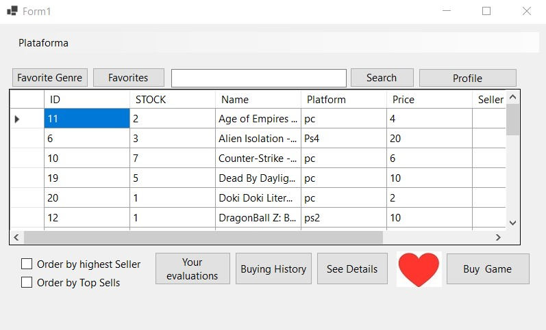

## Funcionalidade: Mostrar descrição do jogo
É possível ver em cada jogo uma breve descrição do mesmo:

```sql
(SqlCommand cmd = new SqlCommand("SELECT DESCRICAO_JOGO FROM ONLINEGAMES_PLATFORM.JOGO WHERE NOME = @gameName", cn))
```

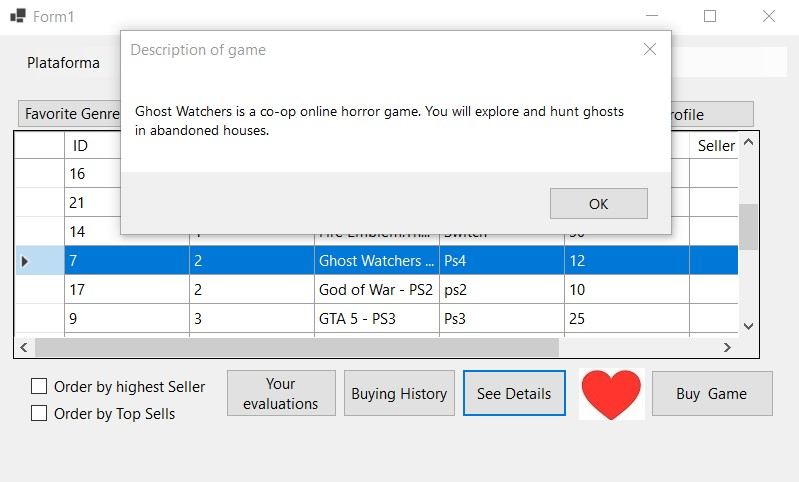

## Funcionalidade: Comprar Jogo

```sql
-- Show data on the form
 string sql = "ONLINEGAMES_PLATFORM.ComprarJogo";
```

```sql
-- Show data on the form
CREATE PROCEDURE ONLINEGAMES_PLATFORM.ComprarJogo
    @NOME_JOGO VARCHAR(100),
    @ID_ANUNCIO INT,
    @NIF_COMPRADOR VARCHAR(30)
AS
BEGIN
    SET NOCOUNT ON;

    -- inserir a compra na tabela COMPRA
    INSERT INTO ONLINEGAMES_PLATFORM.COMPRA(NIF_COMPRADOR, NOME_JOGO, ID_ANUNCIO, NR_ARTIGOS)
    VALUES(@NIF_COMPRADOR, @NOME_JOGO, @ID_ANUNCIO, 1);

    RETURN 1; -- Retorna 1 se a operação for bem sucedida
END
GO
```

A seguinte Stored Procedure que implementámos foi a ComprarJogo.
A sua função é atualizar a tabela compra sempre que ocorre uma compra de um jogo na nossa plataforma.

A cláusula INSERT é usada para adicionar um registro à tabela ONLINEGAMES_PLATFORM.COMPRA do NIF do comprador, nome do jogo, ID do anúncio e Número de artigos que são fornecidos através dos parâmetros @NIF_COMPRADOR, @NOME_JOGO, @ID_ANUNCIO e para o campo NR_ARTIGOS o valor vai ser sempre 1, pois só pode ser afetuada a compra de um jogo de cada vez.

Esta retorna o valor 1 se a operação for efetuada com sucesso.

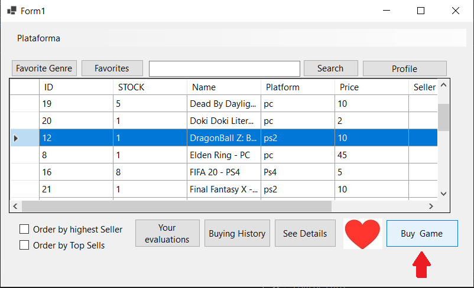

## Funcionalidade: Inserir Avaliação de um vendedor

```sql
-- Show data on the form
 string sqlRating = "ONLINEGAMES_PLATFORM.InserirAvaliacao";
```

```sql
CREATE PROCEDURE ONLINEGAMES_PLATFORM.InserirAvaliacao
    @NIF_COMPRADOR VARCHAR(30),
    @NIF_VENDEDOR VARCHAR(30),
    @AVALIACAO DECIMAL(3,1),
    @data_avaliacao DATETIME
AS
BEGIN
    SET NOCOUNT ON;
    INSERT INTO ONLINEGAMES_PLATFORM.AVALIACAO_VENDEDOR
    (NIF_COMPRADOR, NIF_VENDEDOR, AVALIACAO_VENDEDOR, data_avaliacao)
    VALUES (@NIF_COMPRADOR, @NIF_VENDEDOR, @AVALIACAO, @data_avaliacao);
END
GO
```

A função desta Stored Procedure é inserir uma avaliação de um vendedor na tabela avaliação_vendedor.

A Stored Procedure recebe como valores de entrada o NIF do vendedor, o NIF do comprador(que está a efetuar a avaliação), a avaliação em causa e a data de avaliação.


## Funcionalidade: Ordenação por vendas.

```sql
string sqlCommand = ("ONLINEGAMES_PLATFORM.GetJogosOrdenadosPorVendas");
```

```sql
CREATE PROCEDURE ONLINEGAMES_PLATFORM.GetJogosOrdenadosPorVendas
AS
BEGIN
    SELECT
        J.ANUNCIO_ID AS [ID],
        J.STOCK,
        J.NOME AS [Name],
        J.NOME_PLATAFORMA AS [Platform],
        J.PRECO AS [Price],
        AVG(AV.AVALIACAO_VENDEDOR) AS [Seller review],
        A.NIF_VENDEDOR AS [NIF Seller],
        ISNULL(C.Total_Sold, 0) AS [Total sold]
    FROM ONLINEGAMES_PLATFORM.JOGO J
    LEFT JOIN ONLINEGAMES_PLATFORM.ANUNCIOS A ON J.ANUNCIO_ID = A.ID
    LEFT JOIN ONLINEGAMES_PLATFORM.AVALIACAO_VENDEDOR AV ON A.NIF_VENDEDOR = AV.NIF_VENDEDOR
    LEFT JOIN
    (
        SELECT NOME_JOGO, ID_ANUNCIO, SUM(NR_ARTIGOS) as Total_Sold
        FROM ONLINEGAMES_PLATFORM.COMPRA
        GROUP BY NOME_JOGO, ID_ANUNCIO
    ) C
    ON J.NOME = C.NOME_JOGO AND J.ANUNCIO_ID = C.ID_ANUNCIO
    GROUP BY
        J.ANUNCIO_ID,
        J.STOCK,
        J.NOME,
        J.NOME_PLATAFORMA,
        J.PRECO,
        A.NIF_VENDEDOR,
        C.Total_Sold
    ORDER BY [Total sold] DESC;
END;
GO
```

O objetivo desta Stored Procedura é retornar uma tabela ordenada pelos jogos com mais vendas (no topo da lista) para os jogos que têm menos vendas (para o fim da lista).

Executamos um LEFT JOIN entre a tabela de jogos e anúncios de forma a obter informações relevantes dos jogos anunciados, associando a coluna ANUNCIO_ID da tabela JOGO à coluna ID da tabela ANUNCIOS.

Após isto, executamos outro LEFT JOIN com a tabela AVALIACAO_VENDEDOR de forma a calcular a média das avaliações dos vendedores dos jogos anunciados, associando a coluna NIF_VENDEDOR da tabela ANUNCIOS à coluna NIF_VENDEDOR da tabela AVALIACAO_VENDEDOR.

A subconsulta é utilizada para realizar um LEFT JOIN com a tabela COMPRA, com o intuito de calcular o total de artigos vendidos para cada jogo. Esta subconsulta agrupa os valores da tabela COMPRA, por NOME_JOGO e ID_ANUNCIO e de seguida calcula a soma do número de jogos vendidos. O resultado é depois associado à tabela JOGO.

Por fim, é ordenada a tabela final por ordem decrescente, com base no valor total de vendas.


## Funcionalidade: Obter jogos por plataforma

```sql
SqlCommand cmd = new SqlCommand("ONLINEGAMES_PLATFORM.GetJogosPorPlataforma", cn)
```

```sql
CREATE PROCEDURE ONLINEGAMES_PLATFORM.GetJogosPorPlataforma
    @NOME_PLATAFORMA VARCHAR(50)
AS
BEGIN
    SET NOCOUNT ON;

    SELECT
        J.ANUNCIO_ID AS [ID],
        J.STOCK,
        J.NOME AS [Name],
        J.NOME_PLATAFORMA AS [Platform],
        J.PRECO AS [Price],
        AV.AVALIACAO_VENDEDOR AS [Seller review],
        A.NIF_VENDEDOR AS [NIF Seller]
    FROM
        ONLINEGAMES_PLATFORM.JOGO J
    JOIN
        ONLINEGAMES_PLATFORM.ANUNCIOS A ON J.ANUNCIO_ID = A.ID
    LEFT JOIN
        ONLINEGAMES_PLATFORM.AVALIACAO_VENDEDOR AV ON A.NIF_VENDEDOR = AV.NIF_VENDEDOR
    WHERE
        J.NOME_PLATAFORMA = @NOME_PLATAFORMA;

END
GO
```

O objetivo desta Stored Procedure é retornar uma tabela com apenas todos os jogos de uma certa plataforma selecionada pelo utilizador. Não devendo aparecer qualquer jogo que não pertença à plataforma selecionada.

Para isso filtramos os jogos com base no nome da plataforma, comparando o valor do parâmetro com a coluna "NOME_PLATAFORMA" da tabela jogo, retornando apenas os jogos da plataforma especificada.

Como podemos ver no exemplo abaixo, quando clicamos na box "Plataforma" e selecionamos 'Ps4' apenas os jogos que correspondem à plataforma PS4 são apresentados:


## Funcionalidade: Obter apenas jogos associados ao Género Favorito

```sql
-- Show data on the form
 (SqlCommand command = new SqlCommand("ONLINEGAMES_PLATFORM.GetJogosGeneroFavorito", connection))
```

```sql
CREATE PROCEDURE ONLINEGAMES_PLATFORM.GetJogosGeneroFavorito
    @NIF_Comprador VARCHAR(30)
AS
BEGIN
    SET NOCOUNT ON;

    SELECT
        J.ANUNCIO_ID AS [ID],
        J.STOCK,
        J.NOME AS [Name],
        J.NOME_PLATAFORMA AS Platform,
        J.PRECO AS Price,
        AVG(AV.AVALIACAO_VENDEDOR) AS [Seller review],
        A.NIF_VENDEDOR AS [NIF Seller],
        GP.Nome_Genero AS Genre
    FROM ONLINEGAMES_PLATFORM.JOGO J
    JOIN ONLINEGAMES_PLATFORM.ANUNCIOS A ON J.ANUNCIO_ID = A.ID
    JOIN ONLINEGAMES_PLATFORM.TEM T ON J.ANUNCIO_ID = T.ID_ANUNCIO
    JOIN ONLINEGAMES_PLATFORM.GENERO_PREFERIDO GP ON T.Nome_Genero = GP.Nome_Genero
    LEFT JOIN ONLINEGAMES_PLATFORM.AVALIACAO_VENDEDOR AV ON A.NIF_VENDEDOR = AV.NIF_VENDEDOR
    WHERE GP.NIF_Comprador = @NIF_Comprador
    GROUP BY
        J.ANUNCIO_ID,
        J.STOCK,
        J.NOME,
        J.NOME_PLATAFORMA,
        J.PRECO,
        A.NIF_VENDEDOR,
        GP.Nome_Genero;

END
GO
```

De seguida, a Stored Procedure que elaboramos foi a GetJogosGeneroFavorito.
Nesta procedure, é tomada em consideração o género favorito de um utilizador da plataforma de forma a retornar uma lista de jogos com apenas os jogos do género favorito do utilizador.

Filtramos os jogos com base no parâmetro @NIF_COMPRADOR e no género favorito do comprador. Ocorre uma comparação entre a coluna NIF_COMPRADOR da tabela GENERO_PREFERIDO com o parâmetro de entrada, de forma a retornar apenas os jogos que pertencem ao género favorito do utilizador.

De forma a apresentar as várias colunas que pretendemos, temos que executar diversos JOINS entre várias tabelas.

Para o exemplo que foi dado anteriormente onde adicionámos terror como género favorito:

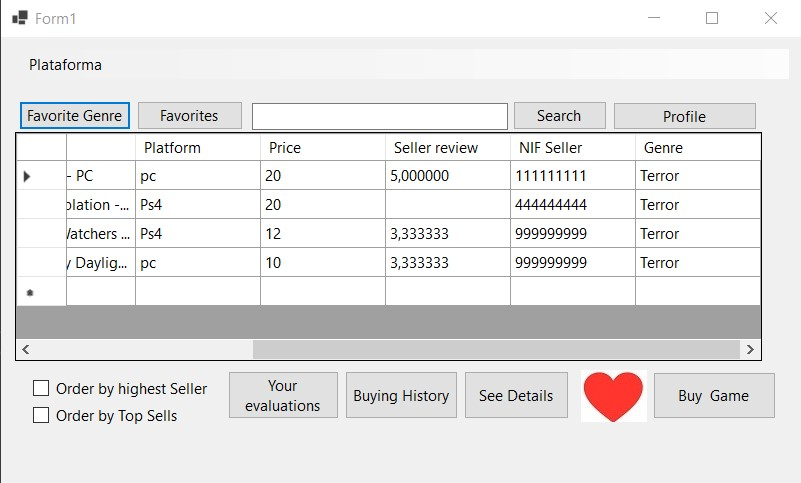

## Funcionalidade: Ordenar jogos por avaliação média dos vendedores

```sql
-- Show data on the form
(SqlCommand cmd = new SqlCommand("ONLINEGAMES_PLATFORM.GetJogosOrdenadosPorVendedor", cn))
```

```sql
CREATE PROCEDURE ONLINEGAMES_PLATFORM.GetJogosOrdenadosPorVendedor
AS
BEGIN
    SELECT
        J.ANUNCIO_ID AS [ID],
        J.STOCK,
        J.NOME AS [Name],
        J.NOME_PLATAFORMA AS Platform,
        J.PRECO AS Price,
        AVG(AV.AVALIACAO_VENDEDOR) AS [Seller review],
        A.NIF_VENDEDOR AS [NIF Seller]
    FROM
        JOGO J
    JOIN
        ANUNCIOS A ON J.ANUNCIO_ID = A.ID
    JOIN
        VENDEDOR V ON A.NIF_VENDEDOR = V.NIF
    JOIN
        AVALIACAO_VENDEDOR AV ON V.NIF = AV.NIF_VENDEDOR
    GROUP BY
        J.ANUNCIO_ID, J.STOCK, J.NOME, J.NOME_PLATAFORMA, J.PRECO, A.NIF_VENDEDOR
    ORDER BY
        AVG(AV.AVALIACAO_VENDEDOR) DESC;
END
GO

```

Esta Stored Procedure retorna uma lista de jogos ordenados pela avaliação média do vendedor.
Sendo os jogos dos vendedores com melhores avaliações retornados para o topo da lista e os jogos que têm vendedores com piores avaliações no fim da lista.
Vendedores que não tenham avaliação não aparecem na lista.

Para isto, começamos por selecionar as colunas que vão ser retornadas pela stored procedure com a cláusula "SELECT", que neste caso, são o ID do Anúncio, o Stock, o nome, o nome da Plataforma, o preço, a avaliação média do vendedor (vai ser por este atributo que a lista vai ser gerida) e o NIF do vendedor.


## Funcionalidade: Observar histórico de avaliações dadas aos vendedores

```sql
(SqlCommand cmd = new SqlCommand("ONLINEGAMES_PLATFORM.GetAvaliacoesVendedor", cn))
```

```sql
CREATE PROCEDURE ONLINEGAMES_PLATFORM.GetAvaliacoesVendedor
    @NIF_Comprador VARCHAR(30)
AS
BEGIN
    SET NOCOUNT ON;

    SELECT
        NIF_VENDEDOR AS [Seller NIF],
        AVALIACAO_VENDEDOR AS [Seller Evaluation],
        data_avaliacao AS [Evaluation Date]
    FROM
        ONLINEGAMES_PLATFORM.AVALIACAO_VENDEDOR
    WHERE
        NIF_COMPRADOR = @NIF_Comprador;

END
GO
```

Esta Stored Procedure recebe como parâmetro @NIF_COMPRADOR e o seu objetivo é retornar uma lista com todas as avaliações que o comprador fez até ao momento.

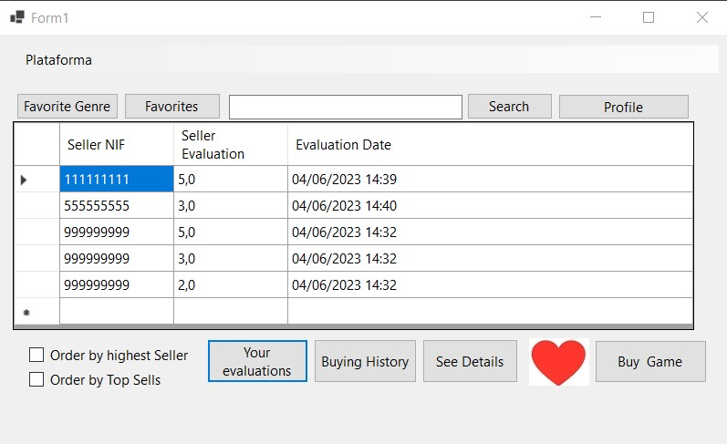

## Funcionalidade: Lista de jogos comprados

```sql
(SqlCommand cmd = new SqlCommand("ONLINEGAMES_PLATFORM.GetJogosComprados", cn))
```

```sql
CREATE PROCEDURE ONLINEGAMES_PLATFORM.GetJogosComprados
    @NIF_Comprador VARCHAR(30)
AS
BEGIN
    SELECT 
        J.NOME AS [Name], 
        J.NOME_PLATAFORMA AS [Platform],
        AV.data_avaliacao AS [Purchase Time]
    FROM 
        ONLINEGAMES_PLATFORM.JOGO J 
    JOIN 
        ONLINEGAMES_PLATFORM.COMPRA C 
    ON 
        J.NOME = C.NOME_JOGO AND J.ANUNCIO_ID = C.ID_ANUNCIO
    JOIN
        ONLINEGAMES_PLATFORM.ANUNCIOS A
    ON
        A.ID = J.ANUNCIO_ID
    JOIN
        ONLINEGAMES_PLATFORM.AVALIACAO_VENDEDOR AV
    ON
        AV.NIF_COMPRADOR = C.NIF_COMPRADOR AND AV.NIF_VENDEDOR = A.NIF_VENDEDOR
    WHERE 
        C.NIF_COMPRADOR = @NIF_Comprador;
END;
GO
```

Esta Stored Procedure tem como função retornar uma lista de todos os jogos que foram comprados pelo comprador até ao momento, ou seja, funciona como um histórico de compra.

Usamos o parâmetro @NIF_COMPRADOR para filtrar as compras com base no nif do comprador.


## Funcionalidade: Adicionar jogos favoritos

```sql
            
string storedProcedureName = "ONLINEGAMES_PLATFORM.sp_AddToFavorites";

SqlCommand command = new SqlCommand(storedProcedureName, cn)

```

```sql
CREATE PROCEDURE ONLINEGAMES_PLATFORM.sp_AddToFavorites
    @NIF_COMPRADOR VARCHAR(30),
    @NOME_JOGO VARCHAR(100),
    @ID_ANUNCIO INT
AS
BEGIN
    IF EXISTS (SELECT 1 FROM ONLINEGAMES_PLATFORM.Comprador WHERE NIF = @NIF_COMPRADOR)
       AND EXISTS (SELECT 1 FROM ONLINEGAMES_PLATFORM.Jogo WHERE NOME = @NOME_JOGO AND ANUNCIO_ID = @ID_ANUNCIO)
    BEGIN
        BEGIN TRY
            INSERT INTO ONLINEGAMES_PLATFORM.Favoritos (NIF_COMPRADOR, NOME_JOGO, ID_ANUNCIO)
            VALUES (@NIF_COMPRADOR, @NOME_JOGO, @ID_ANUNCIO);
        END TRY
        BEGIN CATCH
            -- Se ocorrer algum erro
            SELECT ERROR_MESSAGE() AS ErrorMessage;
        END CATCH
    END
    ELSE
    BEGIN
        SELECT 'Error.' AS ErrorMessage;
    END
END;
GO
```

O objetivo desta Stored Procedure é adicionar jogos favoritos a uma lista, de forma a que estes possam ser consultados mais tarde.
Caso algum erro ocorra e não seja possivel inserir o jogo na lista de favoritos, é retornada uma mensagem de erro.


## Funcionalidade:Ver lista de favoritos

```sql
string storedProcedureName = "ONLINEGAMES_PLATFORM.sp_GetFavoriteGames";
```

```sql
CREATE PROCEDURE ONLINEGAMES_PLATFORM.sp_GetFavoriteGames
    @NIF_COMPRADOR VARCHAR(30)
AS
BEGIN
    SELECT
        J.ANUNCIO_ID AS [ID],
        J.NOME AS [Name],
        J.NOME_PLATAFORMA AS [Platform],
        J.PRECO AS [Price]
    FROM
        ONLINEGAMES_PLATFORM.JOGO J
    JOIN
        ONLINEGAMES_PLATFORM.FAVORITOS F ON J.NOME = F.NOME_JOGO AND J.ANUNCIO_ID = F.ID_ANUNCIO
    WHERE
        F.NIF_COMPRADOR = @NIF_COMPRADOR
    ORDER BY
        J.NOME;
END
GO
```

O objetivo desta Stored Procedure é retornar uma lista de todos os jogos que o utilizador guardou como favoritos.
Para isto, a SP recebe como parâmetro o @NIF_COMPRADOR.
É utilizado um JOIN para unir as tabelas JOGO com a tabela FAVORITOS, com base nas condições de que o nome do jogo seja igual ao nome armazenado na tabela FAVORITOS e que o ID do jogo seja igual ao ID armazenado na tabela FAVORITOS.
Filtramos a lista pelo NIF do comprador e por fim ordenamos pelo nome do JOGO.


## Funcionalidade: Procurar jogos na barra de pesquisa

```sql
(SqlCommand cmd = new SqlCommand("ONLINEGAMES_PLATFORM.sp_SearchJogo", cn))
```

```sql
CREATE PROCEDURE ONLINEGAMES_PLATFORM.sp_SearchJogo
    @searchText VARCHAR(100)
AS
BEGIN
    SELECT
        J.ANUNCIO_ID AS [ID],
        J.STOCK,
        J.NOME AS [Name],
        J.NOME_PLATAFORMA AS [Platform],
        J.PRECO AS [Price],
        AV.AVALIACAO_VENDEDOR AS [Seller review],
        A.NIF_VENDEDOR AS [NIF Seller]
    FROM
        ONLINEGAMES_PLATFORM.JOGO J
        LEFT JOIN ONLINEGAMES_PLATFORM.ANUNCIOS A ON J.ANUNCIO_ID = A.ID
        LEFT JOIN ONLINEGAMES_PLATFORM.AVALIACAO_VENDEDOR AV ON A.NIF_VENDEDOR = AV.NIF_VENDEDOR
    WHERE
        J.NOME LIKE '%' + @searchText + '%'
END
GO
```

A função desta Stored Procedure é permitir pesquisar e retornar uma lista de jogos de acordo com o input que o utilizador colocar na barra de pesquisa.
Para isto, recebe um parâmetro @searchText que representa o texto que o utilizador pesquisa na barra.

São feitos LEFT-JOINS de forma a obter informações relevantes sobre o jogo e os vendedores.


Por fim, filtramos através do parâmetro @searchText, a coluna NOME que pertence à tabela JOGO, é analisada para procurar qualquer correspondência parcial no texto de pesquisa.
Usámos o operador LIKE para indicar que o texto de pesquisa pode aparecer em qualquer posição do nome do jogo.


## Funcionalidade: Eliminar utilizador

```sql
-- Show data on the form
 SqlCommand command = new SqlCommand("ONLINEGAMES_PLATFORM.eliminarutilizador", connection);
```

```sql
CREATE PROCEDURE ONLINEGAMES_PLATFORM.eliminarutilizador @NIF VARCHAR(30)
AS
BEGIN

    DELETE FROM ONLINEGAMES_PLATFORM.FAVORITOS WHERE NIF_COMPRADOR = @NIF;

	DELETE FROM ONLINEGAMES_PLATFORM.AVALIACAO_VENDEDOR WHERE NIF_COMPRADOR = @NIF;

    DELETE FROM ONLINEGAMES_PLATFORM.GENERO_PREFERIDO WHERE NIF_Comprador = @NIF;

    DELETE FROM ONLINEGAMES_PLATFORM.AVALIACAO_JOGO WHERE NIF_COMPRADOR = @NIF;

    DELETE FROM ONLINEGAMES_PLATFORM.AVALIACAO_VENDEDOR WHERE NIF_COMPRADOR = @NIF;

    DELETE FROM ONLINEGAMES_PLATFORM.COMPRA WHERE NIF_COMPRADOR = @NIF;

    DELETE FROM ONLINEGAMES_PLATFORM.Comprador WHERE NIF = @NIF;

    DELETE FROM ONLINEGAMES_PLATFORM.Vendedor WHERE NIF = @NIF;

    DELETE FROM ONLINEGAMES_PLATFORM.Utilizador WHERE NIF = @NIF;
END;
go
```

O função que este Stored Procedured representa é a de eliminar utilzadores que pretendam terminar a sua adesão à loja.
Para isto, remove-se em todas as tabelas a informação relevante do utilizador através do parâmetro @NIF, que se trata do número de Identificação fiscal (único de cada utilizador) do utilizador a ser removido.

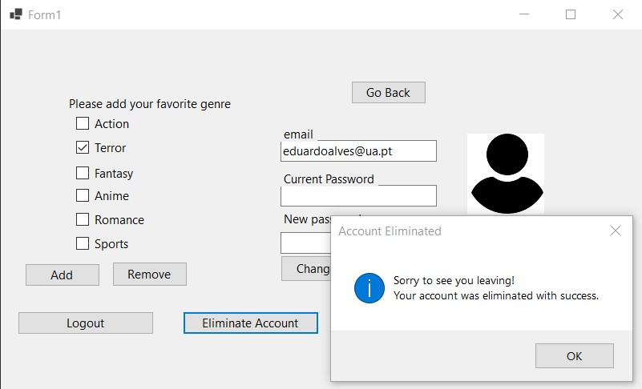

## Triggers

### Trigger: Gerir stock

```sql
CREATE TRIGGER ONLINEGAMES_PLATFORM.Trigger_CheckStock
ON ONLINEGAMES_PLATFORM.COMPRA
INSTEAD OF INSERT
AS
BEGIN
    SET NOCOUNT ON;

    DECLARE @stock INT;
    DECLARE @NOME_JOGO VARCHAR(100);
    DECLARE @ID_ANUNCIO INT;
    DECLARE @NIF_COMPRADOR VARCHAR(30);
    DECLARE @NR_ARTIGOS INT;

    SELECT @NOME_JOGO = NOME_JOGO, @ID_ANUNCIO = ID_ANUNCIO, @NIF_COMPRADOR = NIF_COMPRADOR, @NR_ARTIGOS = 1
    FROM INSERTED;

    SELECT @stock = STOCK
    FROM ONLINEGAMES_PLATFORM.JOGO
    WHERE NOME = @NOME_JOGO AND ANUNCIO_ID = @ID_ANUNCIO;

    IF @stock >= @NR_ARTIGOS
    BEGIN
        -- Atualizar o estoque do jogo na tabela JOGO
        UPDATE ONLINEGAMES_PLATFORM.JOGO
        SET STOCK = STOCK - 1
        WHERE NOME = @NOME_JOGO AND ANUNCIO_ID = @ID_ANUNCIO;

        INSERT INTO ONLINEGAMES_PLATFORM.COMPRA (NIF_COMPRADOR, NOME_JOGO, ID_ANUNCIO, NR_ARTIGOS)
        SELECT NIF_COMPRADOR, NOME_JOGO, ID_ANUNCIO, NR_ARTIGOS FROM INSERTED;
    END
    ELSE
    BEGIN
        RAISERROR ('There is no stock for that game!', 16, 1);
        ROLLBACK TRANSACTION;
        RETURN;
    END
END;

go
```

O primeiro Trigger que foi necessário implementar no projeto está relacionado com o stock disponível de jogos na loja.
A sua função é atualizar as informações dos jogos após a compra de um jogo, reduzindo o valor do stock do jogo acabado de comprar por 1 (visto que apenas conseguimos comprar um jogo de cada vez) e alertar o comprador caso este não consiga comprar um jogo devido à sua falta de stock.

Neste último caso, é retribuida uma mensagem de erro: "There is no stock for that game!", alertando o cliente que não poderá comprar o jogo pretendido naquele momento.

Para isto ser possivel, utiliza-se um IF que atualiza a tabela JOGO com "stock = stock - 1" sempre que o stock do jogo é superior ou igual a 1 e um ELSE quando o stock é igual a 0, retornando a mensagem de erro por falta de Stock.

No caso de não haver stock e um utilzador tentar comprar o jogo, acontece o seguinte:

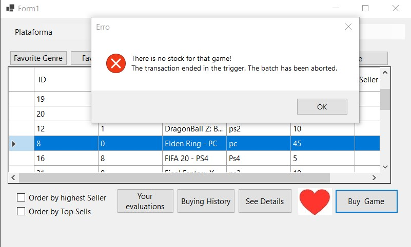

Caso exista pelo menos um jogo em stock, o comprador ao efetuar a compra, reduz o stock existente por um.

Antes de comprar: 2 jogos disponíveis em stock.

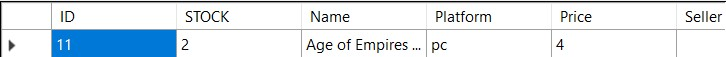

Após comprar: 1 jogo disponível em stock.
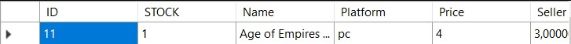

### Trigger: Não permitir duplicações de valores na tabela género favoritos

```sql
CREATE TRIGGER ONLINEGAMES_PLATFORM.trg_check_duplicado_genero_pref
ON ONLINEGAMES_PLATFORM.GENERO_PREFERIDO
INSTEAD OF INSERT
AS
BEGIN
    SET NOCOUNT ON;

    -- Se o gênero que está sendo inserido já existe como um gênero favorito do mesmo NIF_Comprador, não faça nada.
    -- Caso contrário, inserção.
    INSERT INTO ONLINEGAMES_PLATFORM.GENERO_PREFERIDO (NIF_Comprador, Nome_Genero)
    SELECT i.NIF_Comprador, i.Nome_Genero
    FROM inserted i
    WHERE NOT EXISTS (
        SELECT 1
        FROM ONLINEGAMES_PLATFORM.GENERO_PREFERIDO gp
        WHERE gp.NIF_Comprador = i.NIF_Comprador AND gp.Nome_Genero = i.Nome_Genero
    );
END;
GO

```

O segundo Trigger que requis uma implementação foi o "trg_check_duplicado_genero_pref".
O objetivo deste trigger é garantir que caso um utilizador que já tenha géneros preferidos a si associados, não cause duplicações de jogos na tabela ao selecionar de novo o mesmo género preferido.

Caso tentemos aplicar de novo um género favorito já escolhido previamente pelo utilizador, a plataforma informa que a escolha foi adicionada com sucesso sem ocorrer erros ou repetições nas tabelas.

Após tentar adicionar o género "Terror" que já estava selecionado previamente, retorna a seguinte mensagem:

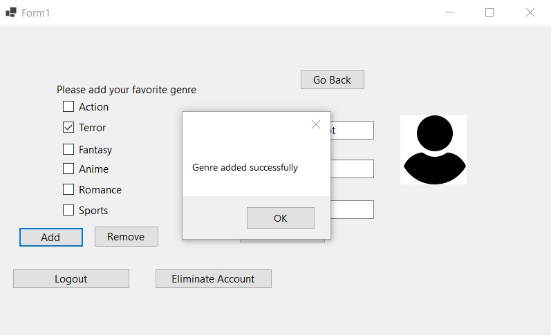

## Normalização/Normalization

Após a análise das nossas tabelas verificamos que o nosso esquema está na Terceira Forma Normal (3FN).

A normalização de dados envolveu organizar e estruturar as tabelas da nossa base de dados, de forma a minimizar a duplicação de dados e reduzir o espaço necessário para armazenar estes dados.

Para isto, utilizámos os seguintes passos:

1º- Começamos por identificar as chaves primárias de cada tabela.

2º- Eliminámos as dependencias parciais. Uma dependência parcial acontece quando um atributo de uma tabela depende apenas de parte uma parte da chave primária, e não de toda a chave primária.

3º- Eliminámos atributos não chave que dependem de outros atributos que não são a chave primária. Quando um atributo depende de outro que não é a chave primária ocorre uma dependência funcional entre esses atributos. 


## Índices/Indexes

Com o objetivo de acelarar as consultas de leitura criámos 3 indexes sobre as colunas mais usadas nas consultas à nossa base de dados.

De seguida, encontramos o screenshot dos indexes.


[Index SQL](sql/05_Index.sql "SQLFileQuestion")

## Transações

As transações são usadas com o intuito de garantir que as operações em questão sejam executadas com sucesso ou revertidas caso ocorra algum erro, isto é, garante que se houver um erro ao inserir dados em qualquer uma das tabelas, nenhuma das operações será efetuada.
São especialmente úteis para garantir consistência e a integridade dos dados.

No nosso projeto, usamos as transitions no processo de registo e de eliminação de um utilizador.

No caso do registo usámos:

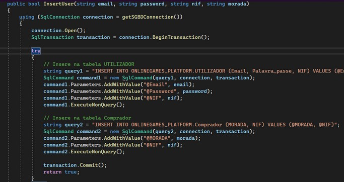

No caso de eliminar o utilizador usámos:


## SQL Programming: Stored Procedures, Triggers, UDF

[SQL SPs and Functions File](sql/02_sp_functions.sql "SQLFileQuestion")

[SQL Triggers File](sql/03_triggers.sql "SQLFileQuestion")

## Outras notas/Other notes

### Dados iniciais da dabase de dados/Database init data

[Indexes File](sql/04_db_init.sql "SQLFileQuestion")
