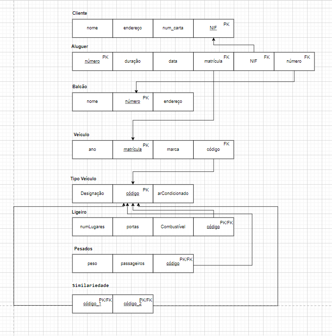
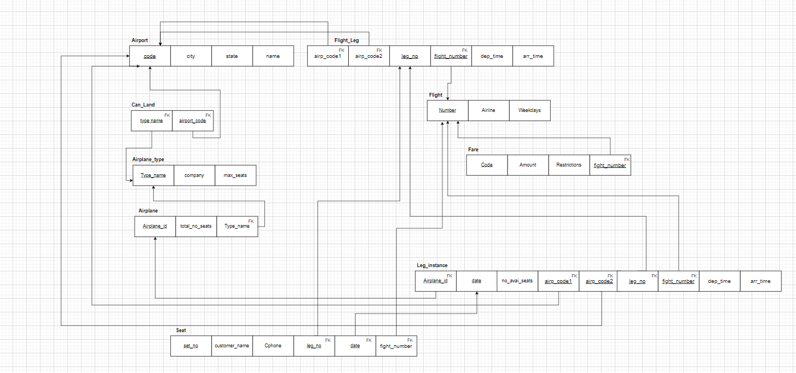

# BD: Guião 3


## ​Problema 3.1
 
### *a)*

```
Cliente: cliente(nome,endereço,num_carta,NIF)
Aluguer: aluguer(número,duração,data,matrícula,NIF,número)
Balcão: balcão(nome,número,endereço)
Veículo: veículo(matrícula,ano,marca,código)
Tipo_veículo: tipo_veículo(designação,arCondicionado,código)
Similariedade:similariedade(código1,código2)
Ligeiro: ligeiro(numLugares,portas,combustível,código)
Pesado: pesado(peso, passageiros,código)
```


### *b)* 

```
                   |Cliente        |      Aluguer       | Balcão | veículo  |
|Chaves candidatas | num_carta,NIF | número             | número | matrícula|
|Chaves principal  |  NIF          | número             | número | matrícula|  
|Chaves estrangeira|               |matrícula,NIF,número|        | código   |

-----------------------------------------------------------------------

                    |Tipo veículo|    Similariedade |  Pesado    |  Ligeiro |
|Chaves candidatas  |  código    | código1,código2  |  código    | código   |
|Chaves principal   |   código   |  código1,código2 |  código    | código   |
|Chaves estrangeira |            |  código1,código2 |  código    | código   |
```


### *c)* 




## ​Problema 3.2

### *a)*

```
Airport(airport_code, city, state, name)

Flight_leg(leg_no, number_flight, airport_code1, arr_time, airport_code2, dep_time)

Flight(number, airline, weekdays)

Fare(code, amount, restrictions, number_flight)

Leg_instance(no_avail_seats, Date,leg_no,number_flight ,airplane_id, arr_time, dep_time, airp_code1, airp_code2)

Seat(seat_no, customer_name, cphone, date, leg_no, number_flight)

Airplane(airplane_id, total_seats, type_name)

Airplane_type(type_name, max_seats, company)

Can_land(type_name,airport_code)

```


### *b)* 

```
                   |Airport      |  Airplane_type |Airplane    |
|Chaves candidatas | Airport_code| Type_name      |Airplane_id |
|Chaves principal  | Airport_code| Type_name      |Airplane_id |
|Chaves estrangeira|             |                | Type_name  |

---------------------------------------------------------------------------  

                   |            Flight_leg               | Flight   | 
|Chaves candidatas |number_flight,leg_no                 |  Number  |
|Chaves principal  |number_flight,leg_no                 |  Number  |
|Chaves estrangeira|number_flight, airp_code1,airp_code2 |          |

----------------------------------------------------------------------------

                    | Fare               |          Leg_instance            |
|Chaves candidatas  |código+number_flight|date,leg_no,number_flight         |                   
|Chaves principal   |código number_flight|date,leg_no,number_flight         |
|Chaves estrangeira |number_flight       |leg_no,number_flight,airplane_id, |
                                          airp_code1,airp_code2             

----------------------------------------------------------------------------

                   | Can_land             |            Seat                 |
|Chaves candidatas |Type_name,Airport_code|seat_no,date,leg_no,number_flight|                   
|Chaves principal  |Type_name,Airport_code|seat_no,date,leg_no,number_flight|
|Chaves estrangeira|Type_name,Airport_code|date,leg_no,number_flight        |


```


### *c)* 




## ​Problema 3.3


### *a)* 2.1


### *b)* 2.2


### *c)* 2.3


### *d)* 2.4

